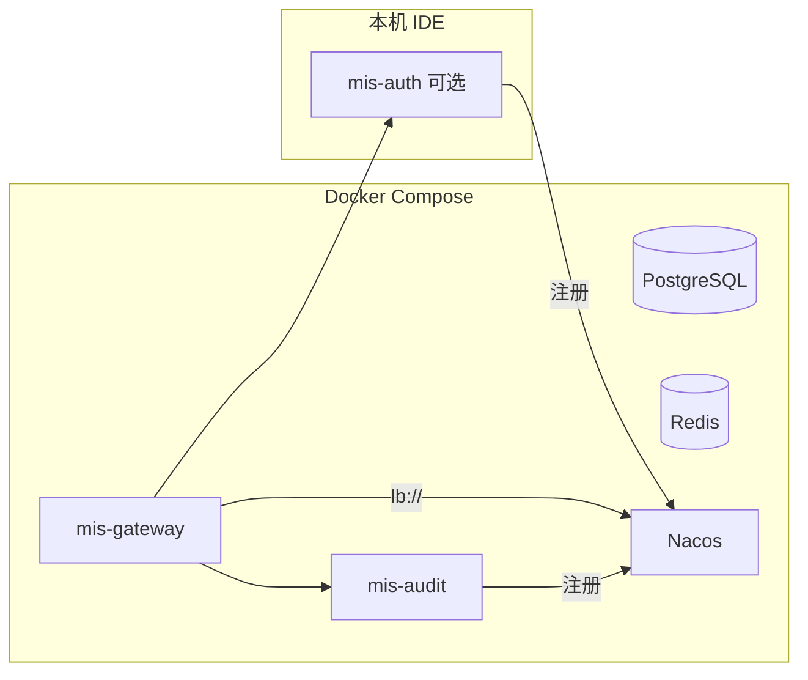

# 混合联调与集成测试

> 模式：**容器稳定服务 + IDE 被测服务** | 命名空间：`integration` | `MIS_REMOTE=true`

## 1. 架构



| 组件 | 运行位置 | 说明 |
|------|----------|------|
| PG / Redis / Nacos | 容器 | `docker-compose.dev.yml` |
| mis-gateway、mis-audit | 容器 | `docker-compose.stack.yml` |
| **被测服务**（如 mis-auth） | **IDE** | `MIS_REMOTE=true` + Nacos 注册 |
| 前端 | 本机 `pnpm dev` | 代理到 Gateway `8080` |

**默认栈不含 mis-auth 容器**，避免与 IDE 争抢 `8101` 端口。

---

## 2. 一次性准备

```powershell
# JWT 密钥
mkdir backend\keys
openssl genrsa -out backend\keys\private.pem 2048
openssl rsa -in backend\keys\private.pem -pubout -out backend\keys\public.pem

# 复制联调环境变量模板
copy .env.integration.example .env.integration
```

---

## 3. 启动稳定栈

```powershell
.\scripts\start-integration-stack.ps1
```

脚本会：

1. 起 PG / Redis / Nacos / MinIO  
2. Flyway 迁移  
3. 创建 Nacos 命名空间 `integration`  
4. 推送 `deploy/nacos-config/integration/` 到 Nacos  
5. 构建并启动 **mis-gateway + mis-audit** 容器  

全量容器（含 mis-auth）：

```powershell
.\scripts\start-integration-stack.ps1 -WithAuthContainer
```

---

## 4. IDE 启动被测服务

### IntelliJ / VS Code

1. Main Class：`com.mis.auth.AuthApplication`  
2. Environment variables：加载 `deploy/ide/mis-auth-integration.env`  

**关键变量：**

| 变量 | 值 | 说明 |
|------|-----|------|
| `MIS_REMOTE` | `true` | 从 Nacos 拉取配置 |
| `NACOS_REGISTER_IP` | `host.docker.internal` | 让容器内 Gateway 能访问宿主机实例 |
| `AUTH_CAPTCHA_ENABLED` | `false` | 联调/集成测试关闭验证码 |

### 验证注册

打开 http://localhost:8848/nacos → 命名空间 **integration** → 服务列表应出现 `mis-auth`（IDE）和 `mis-audit`（容器）。

---

## 5. 手工联调

```text
前端 http://localhost:5173
  → Gateway http://localhost:8080
    → lb://mis-auth（IDE 实例）
    → lb://mis-audit（容器）
```

登录：`admin` / `Mis@123456`（integration 默认关闭验证码）

---

## 6. 自动化集成测试

前置：稳定栈已起，且 **mis-auth 已运行**（IDE 或 `-WithAuthContainer`）。

```powershell
$env:MIS_INTEGRATION_TEST = "true"
$env:MIS_GATEWAY_URL = "http://localhost:8080"

cd backend
.\mvn.ps1 test -pl mis-auth -Dtest=AuthFlowIntegrationTest
```

测试类：`mis-auth` → `AuthFlowIntegrationTest`  
流程：Gateway 登录 → 等待异步写日志 → 带 Token 查 `/api/v1/audit/login-logs`。

未设置 `MIS_INTEGRATION_TEST=true` 时该测试自动跳过，不影响日常 `mvn test`。

---

## 7. 模式对比

| 模式 | 发现 | Gateway 路由 | 配置来源 |
|------|------|-------------|----------|
| local（默认） | 关 | `localhost:端口` 直连 | `application.yml` |
| remote + `integration` | 开 | `lb://服务名` | Nacos `integration` 命名空间 |
| remote + `test` | 开 | `lb://服务名` | Nacos `test` 命名空间 |
| remote + `prod` | 开 | `lb://服务名` | Nacos `prod` 命名空间 |

---

## 8. 常见问题

### Gateway 503 / 找不到 mis-auth

- Nacos `integration` 命名空间是否有 `mis-auth` 实例  
- IDE 是否设置 `NACOS_REGISTER_IP=host.docker.internal`  
- 容器内 mis-auth 与 IDE 是否同时注册（冲突时下线容器实例或不用 `-WithAuthContainer`）

### 登录日志未写入

- mis-audit 容器是否健康  
- mis-auth 是否 `audit-discovery-enabled: true`（integration 默认开）  
- 查看 mis-auth 日志：`写入登录日志失败`

### 端口冲突

- IDE 起 mis-auth 时不要起 mis-auth 容器  
- 或改 `server.port` + Nacos `port` 配置

---

## 10. 关联文档

- [运维总览](README.md)
- [本地开发](local-dev.md)
- [测试环境部署](test-deploy.md)
- [正式环境部署](prod-deploy.md)
