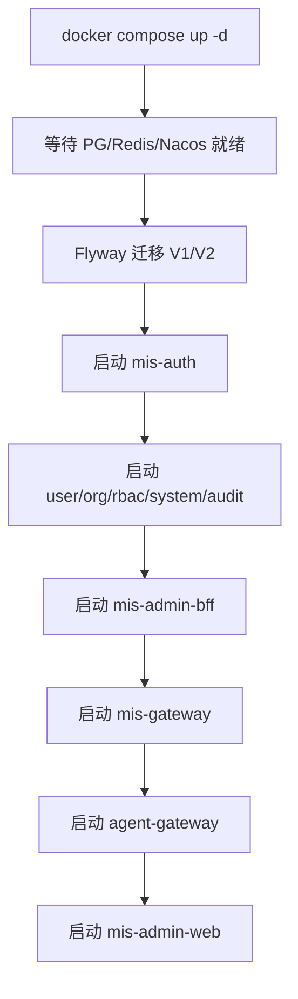

# 本地开发环境

> 状态：📝 草稿 | 版本：v1.0-draft

## 1. 前置依赖

| 工具 | 版本 | 用途 |
|------|------|------|
| JDK | 17 | 后端（环境变量 **`JAVA_HOME_17`**，POM 引用 `${env.JAVA_HOME_17}`） |
| Maven | 3.9+ | 后端构建 |
| Node.js | 20 LTS | 前端 |
| pnpm | 8+ | 前端包管理 |
| Python | 3.11 | 智能体 |
| Docker | 24+ | 基础设施 |
| Docker Compose | 2.x | 本地编排 |

## 2. 开发模式（已确认）

| 模式 | 说明 |
|------|------|
| **A. Docker 基础设施** | Postgres / Redis / Nacos / MinIO 用 `docker-compose.dev.yml` |
| **B. IDE 直跑应用** | Java 服务在 IDE `spring-boot:run`，连 localhost 基础设施 |
| **C. 全 Docker（可选）** | 应用也可容器化；与 B **并存**，开发者自选 |

> Phase 1 **同时支持** B（日常开发）与 A（CI/E2E）；不强制全量 Docker 跑 Java。

## 3. 基础设施（Docker Compose）

文件路径：`deploy/docker-compose.dev.yml`

### 2.1 服务清单

| 服务 | 镜像 | 端口 | 说明 |
|------|------|------|------|
| postgres | postgres:16 | 5432 | 主数据库 |
| redis | redis:7.2 | 6379 | 缓存 |
| nacos | nacos/nacos-server:v2.3.2 | 8848, 9848 | 注册/配置 |
| minio | minio/minio | 9000, 9001 | 对象存储 |

### 2.2 数据库连接

| 项 | 值 |
|----|-----|
| Host | localhost |
| Port | 5432 |
| Database | mis_platform |
| Username | mis |
| Password | mis123 |

### 2.3 Redis

```
redis://localhost:6379/0
```

### 2.4 Nacos（PostgreSQL 外置存储）

| 项 | 值 |
|----|-----|
| 控制台 | http://localhost:8848/nacos |
| 默认账号 | nacos / nacos |
| 配置库 | PostgreSQL `nacos` 库（见 `deploy/postgres/init/02-init-nacos-db.sql`） |

> Nacos Server 用 PG 存配置元数据；**微服务默认不连 Nacos**，见 [配置管理策略](configuration.md)。

导入测试配置：

```powershell
.\scripts\import-nacos-config.ps1 -Namespace test
```

### 2.5 MinIO

| 项 | 值 |
|----|-----|
| API | http://localhost:9000 |
| Console | http://localhost:9001 |
| Access Key | minioadmin |
| Secret Key | minioadmin |

## 3. 应用服务端口

| 服务 | 端口 | 启动命令（规划） |
|------|------|------------------|
| mis-gateway | 8080 | `mvn spring-boot:run -pl mis-gateway` |
| mis-admin-bff | 8081 | `mvn spring-boot:run -pl mis-admin-bff` |
| mis-auth | 8101 | 同上 |
| mis-user | 8102 | 同上 |
| mis-org | 8103 | 同上 |
| mis-rbac | 8104 | 同上 |
| mis-system | 8105 | 同上 |
| mis-audit | 8106 | 同上 |
| agent-gateway | 8200 | `uvicorn app.main:app --reload --port 8200` |
| mis-admin-web | 5173 | `pnpm dev` |

## 4. 启动顺序



## 5. 前端开发代理

`vite.config.ts` 规划：

```typescript
server: {
  port: 5173,
  proxy: {
    '/api': {
      target: 'http://localhost:8080',
      changeOrigin: true,
    },
  },
}
```

## 6. 数据库迁移

- 工具：**Flyway**（独立模块 `backend/mis-migrator`）
- 脚本路径：
  - 评审副本：`docs/db/migrations/`
  - 执行路径：`backend/mis-migrator/src/main/resources/db/migration/`
- 业务微服务 **不** 启用 `spring.flyway`（ADR-001 单库集中迁移）

| 文件 | 内容 |
|------|------|
| V1__init_schema.sql | 建表 |
| V2__seed_data.sql | 种子数据 |

```bash
cd backend
mvn -pl mis-migrator flyway:migrate
```

## 7. 一键脚本

`scripts/init-dev.sh` / `scripts/init-dev.ps1`：

1. `docker compose -f deploy/docker-compose.dev.yml up -d`
2. 等待 Postgres 健康检查
3. `mvn -pl mis-migrator flyway:migrate`
4. 输出访问地址与默认账号

## 8. 本地调试

| 场景 | 方式 |
|------|------|
| 单服务调试 | IDE 启动 Spring Boot，连本地 Docker 基础设施 |
| 前端联调 | pnpm dev + Gateway 8080 |
| 查看 API | http://localhost:8081/swagger-ui.html（BFF） |
| Nacos 配置 | 测试环境可选；正式环境仅文件，见 [configuration.md](configuration.md) |

## 9. 环境变量（.env.example 规划）

```bash
# 数据库
DB_HOST=localhost
DB_PORT=5432
DB_NAME=mis_platform
DB_USER=mis
DB_PASSWORD=mis123

# JDK 17（Maven 父 POM: ${env.JAVA_HOME_17}）
JAVA_HOME_17=C:/Program Files/Eclipse Adoptium/jdk-17.0.11.9-hotspot

# Redis
REDIS_HOST=localhost
REDIS_PORT=6379

# Nacos
NACOS_SERVER=localhost:8848
NACOS_NAMESPACE=dev
NACOS_CONFIG_ENABLED=false
NACOS_CONFIG_GROUP=MIS_GROUP

# 配置策略见 docs/devops/configuration.md
# JWT（开发用；正式走 deploy/config/prod/ 文件）
JWT_PRIVATE_KEY_PATH=./keys/private.pem
JWT_PUBLIC_KEY_PATH=./keys/public.pem
```

## 10. 已确认

- [x] Windows 提供 `init-dev.ps1`
- [x] Flyway 由 **`mis-migrator`** 执行
- [x] 本地 **Docker 基础设施 + IDE 直跑** 双模式
- [x] 使用 `.env.example`，`.env` gitignore

## 11. 关联文档

- [配置管理策略](configuration.md)
- [CI/CD](ci-cd.md)
- [Sprint 计划](../project/sprint-plan.md)
