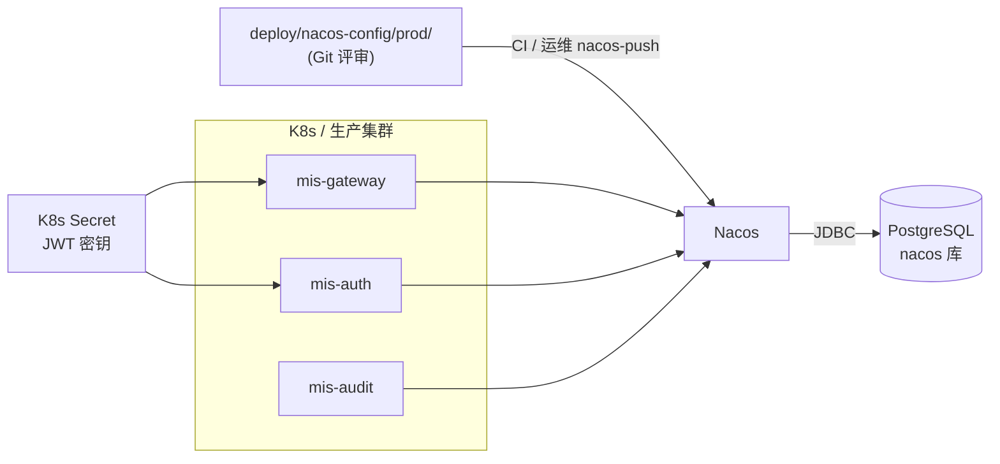

# 正式环境部署

> 模式：**remote** | Nacos 命名空间：`prod` | 配置 Git 源：`deploy/nacos-config/prod/`

正式环境所有微服务 **必须** `MIS_REMOTE=true`，配置权威源为 Nacos（持久化在 PostgreSQL `nacos` 库）。

## 1. 架构



## 2. 发版 Checklist

### 配置

- [ ] `deploy/nacos-config/prod/*.yaml` 已在 PR 中评审
- [ ] 已执行 `nacos-push -Namespace prod` 到 **生产 Nacos**
- [ ] Nacos 控制台 prod 命名空间配置与服务列表正确

### 制品

- [ ] 镜像已构建并推送到私有 Registry（tag = git sha）
- [ ] Flyway 迁移已在 prod 业务库执行（如有新版本）
- [ ] JWT 密钥通过 Secret 挂载，**不**写入镜像或 Nacos 明文

### 运行时

- [ ] 所有微服务 `MIS_REMOTE=true`、`NACOS_NAMESPACE=prod`
- [ ] Gateway 路由为 `lb://`（见 `mis-gateway.yaml`）
- [ ] Cookie `secure: true`（见 `mis-auth.yaml`）

## 3. 配置推送

### 3.1 prod 配置内容摘要

| Data ID | 关键项 |
|---------|--------|
| `mis-common` | 生产 DB/Redis 地址、JWT 公钥路径 |
| `mis-gateway` | `lb://mis-auth`、`lb://mis-audit` 路由 |
| `mis-auth` | `captcha-enabled: true`、`cookie.secure: true`、`audit-discovery-enabled: true` |
| `mis-audit` | 端口、业务参数 |

源文件路径：`deploy/nacos-config/prod/`。

### 3.2 推送命令

```powershell
.\scripts\ensure-nacos-namespace.ps1 -Namespace prod -NacosServer "https://nacos.prod.example.com:8848"
.\scripts\nacos-push.ps1 -Namespace prod -NacosServer "https://nacos.prod.example.com:8848"
```

建议在 CI/CD **部署 Job** 中自动执行：仅当 `deploy/nacos-config/prod/` 有变更时触发。

### 3.3 敏感信息管理

| 类型 | 推荐做法 |
|------|----------|
| JWT 私钥 | K8s Secret 挂载 → `JWT_PRIVATE_KEY_PATH=/etc/mis/keys/private.pem` |
| JWT 公钥 | Secret 或 Nacos `mis-common` 中的路径引用 |
| DB 密码 | K8s Secret → 环境变量 `DB_PASSWORD`，或 Nacos 占位符 + env 注入 |
| Nacos 账号 | 生产禁用默认 `nacos/nacos`，使用独立凭证 |

**不要** 将私钥内容写入 `deploy/nacos-config/prod/*.yaml` 并提交 Git。

## 4. 构建与发布镜像

```powershell
cd backend
.\mvn.ps1 package -pl mis-gateway,mis-auth,mis-audit -am -DskipTests -Pprod

docker build -f deploy/docker/Dockerfile.service `
  --build-arg MODULE=mis-gateway `
  -t registry.example.com/mis-gateway:${GIT_SHA} `
  backend/mis-gateway

docker push registry.example.com/mis-gateway:${GIT_SHA}
```

业务镜像 **仅含 JAR**，不含 `deploy/nacos-config`。

## 5. K8s 部署示例

```yaml
apiVersion: apps/v1
kind: Deployment
metadata:
  name: mis-gateway
spec:
  template:
    spec:
      containers:
        - name: mis-gateway
          image: registry.example.com/mis-gateway:abc1234
          env:
            - name: MIS_REMOTE
              value: "true"
            - name: NACOS_NAMESPACE
              value: prod
            - name: NACOS_SERVER
              value: nacos.prod.svc:8848
            - name: JWT_PUBLIC_KEY_PATH
              value: /etc/mis/keys/public.pem
          volumeMounts:
            - name: jwt-keys
              mountPath: /etc/mis/keys
              readOnly: true
      volumes:
        - name: jwt-keys
          secret:
            secretName: mis-jwt-keys
```

### 滚动更新顺序

1. 推送 Nacos 配置（如有变更）
2. 迁移数据库（`mis-migrator` Job）
3. 更新 mis-audit、mis-auth
4. 更新 mis-gateway（入口最后切换）

## 6. 启动验证

```bash
# 健康检查
curl -s https://api.example.com/actuator/health

# 登录（需验证码，prod 默认开启）
curl -s -X POST https://api.example.com/api/v1/auth/login \
  -H "Content-Type: application/json" \
  -d '{"username":"admin","password":"***","captchaKey":"...","captchaCode":"..."}'
```

| 检查项 | 预期 |
|--------|------|
| Nacos 服务列表 | `mis-gateway`、`mis-auth`、`mis-audit` 实例健康 |
| Gateway 路由 | 经 `lb://` 到达后端，无 503 |
| 审计 | 登录后 `login-logs` 有记录 |
| HTTPS | Cookie `Secure`、Gateway 对外 TLS |

## 7. 回滚

| 层级 | 操作 |
|------|------|
| 应用 | `kubectl rollout undo deployment/mis-gateway` |
| 配置 | Nacos 控制台回退 `mis-*` 历史版本 |
| 数据库 | **禁止** Flyway downgrade；使用补偿 migration |

## 8. 监控与运维

- Nacos 控制台：配置历史、服务实例上下线
- 应用日志：关注 `写入登录日志失败`、Nacos 连接超时
- PG `nacos` 库：定期备份 `config_info` 相关表

## 9. 关联文档

- [运维总览](README.md)
- [配置管理策略](configuration.md)
- [测试环境部署](test-deploy.md)
- [CI/CD](ci-cd.md)
