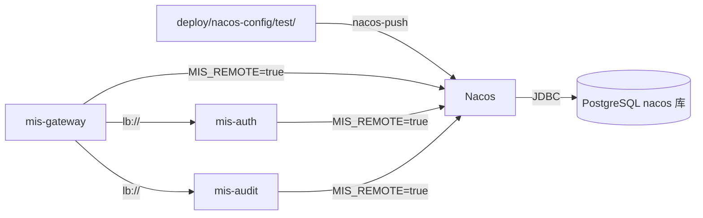

# 测试环境部署

> 模式：**remote** | Nacos 命名空间：`test` | 配置 Git 源：`deploy/nacos-config/test/`

测试环境与正式环境使用 **同一套机制**：配置进 Nacos，微服务只带 JAR + 环境变量，**不把** `deploy/nacos-config` 打进业务镜像。

## 1. 架构



| 组件 | 说明 |
|------|------|
| PostgreSQL | 业务库 `mis_platform` + Nacos 元数据库 `nacos` |
| Redis | 缓存、黑名单 |
| Nacos | 配置中心 + 服务发现（命名空间 `test`） |
| 微服务镜像 | 仅含 JAR，`MIS_REMOTE=true` 启动 |

## 2. 前置条件

- [ ] 测试环境 PostgreSQL、Redis、Nacos 已部署且可达
- [ ] Nacos 使用 PostgreSQL 外置存储（参考 `deploy/nacos/server/application.properties`）
- [ ] 业务库已执行 Flyway 迁移（`mis-migrator`）
- [ ] JWT 密钥已生成，通过 Secret 或卷挂载到容器

## 3. 配置管理

### 3.1 修改配置

在仓库中编辑 `deploy/nacos-config/test/`：

| 文件 | Nacos Data ID | 内容 |
|------|---------------|------|
| `mis-common.yaml` | `mis-common` | 数据源、Redis、JWT 公钥路径 |
| `mis-gateway.yaml` | `mis-gateway` | `lb://` 路由 |
| `mis-auth.yaml` | `mis-auth` | 认证、Cookie、私钥路径 |
| `mis-audit.yaml` | `mis-audit` | 审计服务 |

合并 PR 后，由 CI 或运维执行推送。

### 3.2 推送到 Nacos

```powershell
# 指向测试环境 Nacos 地址
.\scripts\ensure-nacos-namespace.ps1 -Namespace test -NacosServer "http://nacos-test.example.com:8848"
.\scripts\nacos-push.ps1 -Namespace test -NacosServer "http://nacos-test.example.com:8848"
```

```bash
export NACOS_SERVER=http://nacos-test.example.com:8848
./scripts/nacos-push.sh test
```

在 Nacos 控制台验证：命名空间 **test** → 配置列表 → 应有 `mis-common`、`mis-gateway`、`mis-auth`、`mis-audit`（Group: `MIS_GROUP`）。

### 3.3 配置与镜像的关系

```
deploy/nacos-config/test/*.yaml  ──推送──►  Nacos (test 命名空间)
                                                      ▲
mis-gateway.jar (镜像内)  ──MIS_REMOTE=true───────────┘
```

**错误做法**：把 yaml 和 JAR 一起 COPY 进业务容器。  
**正确做法**：发版前/改配置后执行 `nacos-push`，再起容器。

## 4. 构建镜像

```powershell
cd backend
.\mvn.ps1 package -pl mis-gateway,mis-auth,mis-audit -am -DskipTests

# 以 mis-auth 为例
docker build -f deploy/docker/Dockerfile.service `
  --build-arg MODULE=mis-auth `
  -t mis-auth:test `
  backend/mis-auth
```

`Dockerfile.service` 仅复制 JAR，不含外部配置目录。

## 5. 启动微服务

### 5.1 必需环境变量

| 变量 | 值 | 说明 |
|------|-----|------|
| `MIS_REMOTE` | `true` | 启用 Nacos 配置与发现 |
| `NACOS_NAMESPACE` | `test` | 命名空间 |
| `NACOS_SERVER` | 测试 Nacos 地址 | 如 `nacos-test:8848` |
| `JWT_PRIVATE_KEY_PATH` | 容器内路径 | mis-auth 签发 |
| `JWT_PUBLIC_KEY_PATH` | 容器内路径 | gateway 验签 |

数据库、Redis 等可在 `mis-common` 中配置，也可通过环境变量覆盖（`${DB_HOST:...}` 占位符）。

### 5.2 Docker Compose 示例

```yaml
services:
  mis-gateway:
    image: mis-gateway:test
    ports:
      - "8080:8080"
    environment:
      MIS_REMOTE: "true"
      NACOS_NAMESPACE: test
      NACOS_SERVER: nacos:8848
      JWT_PUBLIC_KEY_PATH: /keys/public.pem
    volumes:
      - ./keys:/keys:ro
    depends_on:
      - nacos

  mis-auth:
    image: mis-auth:test
    environment:
      MIS_REMOTE: "true"
      NACOS_NAMESPACE: test
      NACOS_SERVER: nacos:8848
      JWT_PRIVATE_KEY_PATH: /keys/private.pem
      JWT_PUBLIC_KEY_PATH: /keys/public.pem
    volumes:
      - ./keys:/keys:ro
```

### 5.3 启动顺序建议

1. 基础设施（PG / Redis / Nacos）
2. Flyway 迁移
3. `nacos-push -Namespace test`
4. mis-audit、mis-auth（无 Gateway 依赖）
5. mis-gateway

## 6. 验收

| 检查项 | 命令 / 操作 |
|--------|-------------|
| Nacos 配置 | 控制台 test 命名空间 4 个 Data ID |
| 服务注册 | 服务列表有 `mis-gateway`、`mis-auth`、`mis-audit` |
| 健康检查 | `curl http://gateway:8080/actuator/health` |
| 登录流程 | `POST /api/v1/auth/login` 经 Gateway |
| 审计日志 | 登录后查 `/api/v1/audit/login-logs` |

## 7. 配置变更与回滚

| 操作 | 步骤 |
|------|------|
| 更新配置 | 改 Git → `nacos-push` → 服务自动 refresh（`refresh: true`）或滚动重启 |
| 回滚配置 | Nacos 控制台「历史版本」回退，或 Git revert 后重新 push |
| 回滚镜像 | `kubectl rollout undo` 或重新部署上一版 tag |

## 8. 与混合联调的区别

| 项 | 测试环境 `test` | 混合联调 `integration` |
|----|-----------------|--------------------------|
| 用途 | 测试集群 / QA | 本机容器 + IDE 调试 |
| 配置目录 | `deploy/nacos-config/test/` | `deploy/nacos-config/integration/` |
| 启动方式 | 运维 / K8s 部署 | `start-integration-stack.ps1` |
| 文档 | 本文 | [integration-test.md](integration-test.md) |

## 9. 关联文档

- [运维总览](README.md)
- [配置管理策略](configuration.md)
- [正式环境部署](prod-deploy.md)
- [本地开发](local-dev.md)
