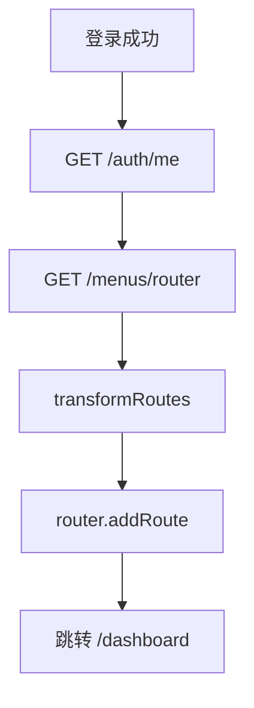

# 管理后台前端设计（mis-admin-web）

> 状态：📝 草稿 | 版本：v1.0-draft  
> 路径：`frontend/mis-admin-web/`

## 1. 技术选型

| 类别 | 选型 | 版本 |
|------|------|------|
| 框架 | React | 18.3 |
| 语言 | TypeScript | 5.x |
| 构建 | Vite | 5.x |
| UI | shadcn/ui + Tailwind CSS | 3.4 |
| 路由 | React Router | 6.22 |
| 服务端状态 | TanStack Query | 5.x |
| 客户端状态 | Zustand | 4.x |
| 表单 | React Hook Form + Zod | — |
| HTTP | Axios | 1.6 |
| 图标 | lucide-react | latest |
| 主题 | next-themes | 0.3 |
| 命令面板 | cmdk | 1.x |
| Toast | sonner | 1.x |
| 日期 | dayjs | 1.11 |

## 2. 目录结构

```
mis-admin-web/
├── public/
├── src/
│   ├── app/                      # 应用入口与路由
│   │   ├── App.tsx
│   │   ├── router.tsx
│   │   └── providers.tsx
│   ├── components/
│   │   ├── ui/                   # shadcn 生成组件
│   │   ├── layout/               # 布局组件
│   │   │   ├── tab-bar.tsx       # 多 Tab 工作区
│   │   │   └── copilot-panel.tsx # AI 占位侧栏
│   │   ├── auth/                 # 权限守卫、PermissionButton
│   │   └── common/               # DataTable、PageHeader、SubmitButton 等
│   ├── hooks/                    # useDebouncedValue、useAsyncAction
│   ├── features/                 # 按业务域划分
│   │   ├── auth/
│   │   ├── dashboard/
│   │   ├── system/
│   │   │   ├── user/
│   │   │   ├── org/
│   │   │   ├── role/
│   │   │   ├── menu/
│   │   │   └── dict/
│   │   └── monitor/
│   ├── hooks/
│   │   ├── use-permission.ts
│   │   └── use-auth.ts
│   ├── lib/
│   │   ├── api/
│   │   │   ├── client.ts
│   │   │   ├── auth.ts
│   │   │   ├── user.ts
│   │   │   └── ...
│   │   └── utils.ts
│   ├── stores/
│   │   ├── auth-store.ts
│   │   ├── app-store.ts
│   │   └── tab-store.ts          # 已打开页面 Tab 状态
│   ├── types/
│   │   ├── api.ts
│   │   └── models.ts
│   ├── styles/
│   │   └── globals.css
│   └── main.tsx
├── components.json               # shadcn 配置
├── tailwind.config.ts
├── vite.config.ts
└── package.json
```

## 3. 路由设计

### 3.1 静态路由

| 路径 | 组件 | 鉴权 |
|------|------|------|
| `/login` | LoginPage | 公开 |
| `/403` | ForbiddenPage | 公开 |
| `/404` | NotFoundPage | 公开 |

### 3.2 动态路由（登录后注册）

| 路径 | 组件 | permission |
|------|------|------------|
| `/dashboard` | DashboardPage | dashboard:view |
| `/system/user` | UserListPage | system:user:list |
| `/system/org` | OrgTreePage | system:org:list |
| `/system/role` | RoleListPage | system:role:list |
| `/system/menu` | MenuTreePage | system:menu:list |
| `/system/dict` | DictPage | system:dict:list |
| `/monitor/login-log` | LoginLogPage | monitor:loginlog:list |
| `/monitor/oper-log` | OperLogPage | monitor:operlog:list |

### 3.3 动态路由注册流程



## 4. 布局设计

```
┌─────────────────────────────────────────────────────┐
│ Header: Breadcrumb | Cmd+K | Theme | User Menu      │
├──────────┬──────────────────────────────────────────┤
│          │                                          │
│ Sidebar  │  Main Content                            │
│ (collaps)│  ┌────────────────────────────────────┐  │
│          │  │ PageHeader + Actions               │  │
│ NavMenu  │  ├────────────────────────────────────┤  │
│          │  │ Page Body                          │  │
│          │  └────────────────────────────────────┘  │
└──────────┴──────────────────────────────────────────┘
```

### 4.1 布局组件

| 组件 | 文件 | 职责 |
|------|------|------|
| AppLayout | `components/layout/app-layout.tsx` | 整体框架 |
| Sidebar | `components/layout/sidebar.tsx` | 侧边导航 |
| Header | `components/layout/header.tsx` | 顶栏 |
| NavMenu | `components/layout/nav-menu.tsx` | 递归菜单 |
| PageHeader | `components/common/page-header.tsx` | 标题+面包屑+操作区 |

### 4.2 响应式

| 断点 | 行为 |
|------|------|
| ≥1024px | 侧边栏常驻，可折叠 |
| <1024px | 侧边栏改为 Sheet 抽屉 |

### 4.3 多 Tab 工作区（Phase 1 ✅）

主内容区顶部 **TabBar**，行为类似 IDE / 浏览器多标签：

| 能力 | 说明 |
|------|------|
| 打开 Tab | 点击侧栏菜单 → 打开或激活对应 Tab |
| 切换 / 关闭 | 单击切换；支持关闭当前、关闭其他、关闭全部 |
| 固定 Tab | 仪表盘可默认固定（pin） |
| 状态保持 | Tab 内列表滚动、筛选条件用 `tab-store` + `keepAlive` 缓存组件 |
| 路由同步 | URL 与当前激活 Tab 一致；刷新恢复当前 Tab |

组件：`components/layout/tab-bar.tsx` + `stores/tab-store.ts`。

### 4.4 AI Copilot 占位（Phase 1 ✅）

| 项 | Phase 1 | Phase 3 |
|----|---------|---------|
| UI | 右侧 **Sheet/抽屉** `CopilotPanel` | 流式对话、上下文 |
| 入口 | Header 图标按钮打开 | — |
| 能力 | 静态欢迎文案 + 输入框 **禁用或 mock** | 真实 LLM + agent-gateway |
| API | 无或 `GET /agent/health` 展示在线状态 | `POST /chat/completions` |

> 占位目的：预留布局与路由，避免 Phase 3 大改壳层。

## 5. 核心页面规格

### 5.1 登录页 `features/auth/login-page.tsx`

**字段：**

| 字段 | 校验 |
|------|------|
| username | 必填，2-64 字符 |
| password | 必填，6-64 字符 |
| captchaCode | 必填，4 位 |

**交互：**
- 提交 → `POST /auth/login`
- 成功 → 存 token → 拉 me + router → 跳 dashboard
- 失败 → toast + 刷新验证码
- 回车提交

### 5.2 仪表盘 `features/dashboard/dashboard-page.tsx`

**区块：**
1. 统计卡片 × 4：用户数、部门数、今日登录、在线用户
2. 快捷入口：用户管理、组织管理、角色管理
3. 最近操作日志表格（Top 10）

### 5.3 用户管理 `features/system/user/`

**布局：** 左侧组织树（宽 240px）+ 右侧用户表格

**表格列：**

| 列 | 字段 | 操作 |
|----|------|------|
| 工号 | employeeNo | — |
| 用户名 | username | — |
| 姓名 | realName | — |
| 部门 | orgName | — |
| 手机 | phone | — |
| 状态 | status | Badge |
| 创建时间 | createdAt | 格式化 |
| 操作 | — | 编辑/重置密码/禁用/分配角色/删除 |

**弹窗：**
- `UserFormDialog` — 新增/编辑
- `AssignRoleDialog` — 多选角色
- `ResetPasswordDialog` — 确认重置

**筛选：** username, realName, status；组织树点击过滤 orgId

### 5.4 组织管理 `features/system/org/`

- 树形表格展示部门层级
- 操作：新增子部门、编辑、删除（ConfirmDialog）
- Phase 1 不做拖拽排序，用 sort 数字字段

### 5.5 角色管理 `features/system/role/`

**列表列：** 角色名称、编码、数据范围、状态、创建时间、操作

**编辑 Drawer / Dialog Tabs：**
1. 基本信息（name, code, dataScope, remark）
2. 菜单权限（Checkbox 树，支持半选）
3. 数据权限（`data_scope=5` 时显示组织多选 + 部门多选；`data_scope=6` 无需额外配置）

### 5.6 菜单管理 `features/system/menu/`

**三栏布局：**

| 栏 | 内容 |
|----|------|
| 左 | 菜单树（目录 / 菜单页 / 按钮） |
| 中 | 选中节点表单：名称、类型、path、component、**permission**、排序、状态 |
| 右 | **API 列表**（仅 type=2 菜单页、type=3 按钮可编辑） |

**API 列表列：** method、path_pattern、说明、排序、操作（增删改）

- 菜单页：绑定页面加载 API（如 GET 列表、GET 组织树）
- 按钮：绑定操作 API 组（如编辑 = GET 详情 + PUT 保存）
- 保存后调用 `POST/PUT/DELETE /menus/{id}/apis`，触发后端 Registry 刷新

类型标签：目录 / 菜单 / 按钮

### 5.7 字典管理 `features/system/dict/`

- 左侧字典类型列表
- 右侧字典项表格 CRUD

### 5.8 日志页 `features/monitor/`

- 标准筛选 + DataTable + 分页
- 操作日志详情 Dialog 展示 request_params

## 6. 状态管理

### 6.1 auth-store

```typescript
interface AuthState {
  accessToken: string | null;
  user: UserInfo | null;
  permissions: string[];
  setAuth: (token: string, user: UserInfo) => void;
  setPermissions: (permissions: string[]) => void;
  logout: () => void;
}
```

### 6.2 app-store

```typescript
interface AppState {
  sidebarCollapsed: boolean;
  theme: 'light' | 'dark' | 'system';
  toggleSidebar: () => void;
  setTheme: (theme: string) => void;
}
```

## 7. API Client

### 7.1 Axios 实例 `lib/api/client.ts`

```typescript
// 伪代码规格
const client = axios.create({ baseURL: '/api/v1', timeout: 30000 });

// 请求拦截：注入 Authorization
// 响应拦截：
//   code !== 0 → toast + reject
//   401 → refresh 队列（单飞锁）→ 重试 / 跳登录
//   403 → toast + 可选跳 /403
```

### 7.2 Refresh 单飞锁

多个 401 并发时，只发一次 refresh，其余请求排队等待新 token。

### 7.3 防抖与防重复提交（全站统一）

两类问题**不要混在一个拦截器里**，分层统一即可覆盖登录页及所有业务页。

| 场景 | 手段 | 落点 |
|------|------|------|
| 搜索框、筛选、Cmd+K 输入 | **防抖**（延迟触发请求） | `useDebouncedValue` + Query `enabled` |
| 表单保存、删除、登录、批量操作 | **防重复提交**（进行中不可再点） | `useMutation` + `SubmitButton` + 可选 Axios 去重 |
| 写接口最后一道防线 | **幂等**（可选） | 后端 `Idempotency-Key`（Sprint 2 BFF） |

#### 7.3.1 写操作：默认 `useMutation`（推荐）

所有 POST/PUT/DELETE 经 TanStack Query `useMutation`，按钮绑定 `isPending`，全站一致：

```typescript
// features/system/user/hooks/use-create-user.ts
export function useCreateUser() {
  return useMutation({
    mutationFn: (body: CreateUserDto) => userApi.create(body),
    onSuccess: () => {
      toast.success('创建成功');
      queryClient.invalidateQueries({ queryKey: ['users'] });
    },
  });
}

// 页面内
const { mutate, isPending } = useCreateUser();
<SubmitButton loading={isPending} onClick={() => mutate(form.getValues())}>
  保存
</SubmitButton>
```

`isPending` 为 true 时按钮自动 `disabled` + loading，**无需每个页面手写锁**。

#### 7.3.2 通用组件 `SubmitButton`

路径：`src/components/common/submit-button.tsx`

- 包装 shadcn `Button`：`loading` 时 `disabled` + `Loader2` 图标
- 表单场景配合 RHF：`disabled={isPending || form.formState.isSubmitting}`
- 登录、弹窗保存、列表行内操作**全部复用同一组件**

#### 7.3.3 通用 Hook `useAsyncAction`（非 Query 场景）

极少数不走 Query 的异步（如导出、文件上传）：

```typescript
// hooks/use-async-action.ts
// 返回 { run, loading }；loading 期间再次 run 直接忽略
const { run, loading } = useAsyncAction(async () => { ... });
```

#### 7.3.4 Axios 可选：写请求短时去重（兜底）

在 `client.ts` 请求拦截器中，对 **相同 method + url + body** 的并发写请求：

- 默认：**取消前一个** 或 **直接拒绝后一个**（可配置 `meta.dedupe: true`）
- GET 不走此逻辑（由 Query 缓存与 `staleTime` 负责）
- 显式跳过去重：`client.post(url, data, { meta: { skipDedupe: true } })`

与 `useMutation.isPending` **叠加**：UI 层防手抖，拦截器防极端连点/双指点击。

#### 7.3.5 搜索防抖：`useDebouncedValue`

```typescript
const [keyword, setKeyword] = useState('');
const debounced = useDebouncedValue(keyword, 300);

const { data } = useQuery({
  queryKey: ['users', debounced],
  queryFn: () => userApi.list({ keyword: debounced }),
  enabled: debounced.length === 0 || debounced.length >= 2,
});
```

列表、组织树搜索、字典筛选**统一此模式**，不在 `onChange` 里直接打 API。

#### 7.3.6 目录约定（补充 §2）

```
src/
├── hooks/
│   ├── use-debounced-value.ts
│   └── use-async-action.ts
├── components/common/
│   └── submit-button.tsx
└── lib/api/
    ├── client.ts              # 含 dedupe 拦截器
    └── dedupe-pending.ts      # 进行中的写请求 Map
```

#### 7.3.7 与后端配合

- Phase 1：前端统一策略即可满足 MVP
- Sprint 2 起：BFF 写接口支持 `Idempotency-Key` 头，与前端 `SubmitButton` 可选联动（同一次点击生成 UUID 放入 header）

## 8. shadcn 组件清单（Phase 1）

```
button, input, label, form, table, dialog, dropdown-menu,
select, checkbox, switch, badge, avatar, separator, sheet,
tabs, card, breadcrumb, pagination, popover, command, skeleton,
alert, sonner, tooltip, scroll-area, sidebar
```

## 9. 设计 Token

```css
:root {
  --primary: 221.2 83.2% 53.3%;
  --radius: 0.5rem;
  --sidebar-width: 16rem;
  --sidebar-width-collapsed: 4rem;
}
```

字体栈：`Inter, "PingFang SC", "Microsoft YaHei", sans-serif`

## 10. Command Palette（Cmd+K）

搜索范围：
- 菜单导航跳转
- 用户名搜索（Phase 1 可选）

## 11. 环境变量

| 变量 | 说明 | 示例 |
|------|------|------|
| VITE_API_BASE_URL | API 基础路径 | `/api/v1` |
| VITE_APP_TITLE | 应用标题 | MIS Platform |

开发环境 Vite proxy → `http://localhost:8080`

## 12. 已确认（Phase 1）

- [x] **多 Tab 工作区**（§4.3）
- [x] **AI Copilot 占位侧栏**（§4.4，无真实 LLM）
- [x] 个人中心 / 修改密码页（ADR-014 F3/F4）
- [ ] 表格组件是否封装统一 `DataTable` 还是每页独立
- [ ] 是否引入 i18n 文件结构（`locales/zh-CN.json`）
- [ ] 部门树是否使用 shadcn 原生 Tree 或自研

## 13. 关联文档

- [接口规范](../api/api-specification.md)
- [权限清单](../api/permissions.md)
- [编码规范](../project/conventions.md)
