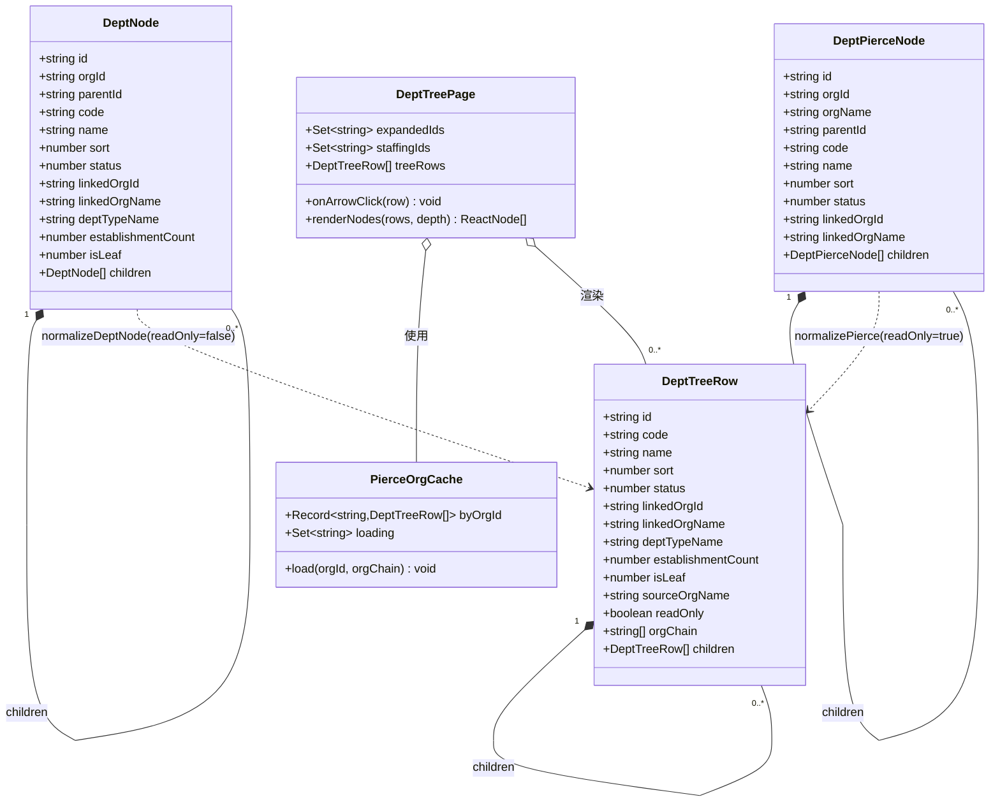
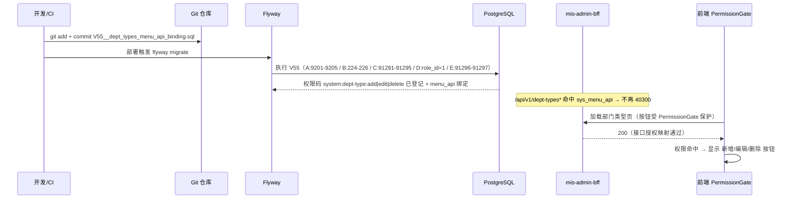
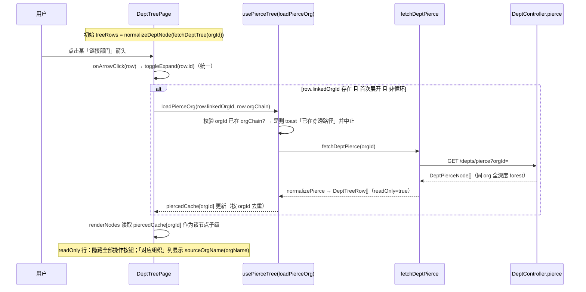

# 增量架构设计：部门类型 CRUD 修复 + 部门树 inline 穿透

> 作者：高见远（架构师） ｜ 日期：2026-08-17 ｜ 范围：MIS 平台「部门管理」现有项目增量开发
> 关联需求：① 部门类型页新增/编辑/删除按钮不可见；② 部门树下钻改为左侧 inline 展开（穿透只读）

---

## 0. 现状结论速览（主理人调查 + 本人读码核实）

| # | 问题 | 根因（已核实） | 修复方式 | 是否改前端 |
|---|------|----------------|----------|------------|
| Issue 1 | 部门类型 CRUD 按钮看不到 | 补偿迁移 `V55__dept_types_menu_api_binding.sql` **未纳入版本控制 + 未跑 Flyway** → `sys_menu_api` 缺失 → BFF 对 `/api/v1/dept-types*` 返回 40300 → `PermissionGate` 检测不到 `system:dept-type:add\|edit\|delete` → 按钮被隐藏 | **提交并激活 V55**（纯 DB） | **否**（CRUD 代码已就绪且 typecheck 通过） |
| Issue 2 | 穿透是右侧弹窗而非 inline | 设计如此（`OrgPierceDrawer`）；现需改为左侧 inline 展开 | `dept-tree-page.tsx` 改造 + 删除 `OrgPierceDrawer` | **是** |

**关键核实点（本人读码确认）：**
- `DeptController` 已暴露 5 个 `dept-types` 端点 + `GET /depts/pierce`（后端 OK）。
- `DeptService.pierce(orgId)` → `toPierceVo` **递归返回该 org 全深度嵌套 forest**；跨 org 链接节点仅携带 `linkedOrgId/linkedOrgName`，其下级需**再次** `fetchDeptPierce`。
- `OrgPierceDrawer` 仅被 `dept-tree-page.tsx` 引用（import 第 31 行、渲染第 711 行），无 barrel 再导出 → **删除安全**。
- `fetchDeptPierce` 定义于 `depts.ts`，将被新 inline 逻辑复用（保留）。

---

# Part A：系统设计

## 1. 实现方案（Implementation Approach）

### 1.1 技术难点
1. **Issue 1 是配置/迁移遗漏，非代码缺陷**：前端 CRUD 与后端端点均已就绪，仅缺 Flyway 迁移落地。难点在「确认 V55 内容完整 + 落地路径」，不涉编码。
2. **Issue 2 是渲染模型统一 + 懒加载状态管理**：需让同一棵递归树同时承载「本地可编辑部门」与「穿透只读部门」，且不破坏现有 `expandedIds` 折叠语义、不引入重复请求。

### 1.2 框架与库选择
- **沿用现有技术栈，不新增任何依赖**：React 18 + MUI + Tailwind + `lucide-react`（图标）+ `sonner`（toast）+ `PermissionGate`（现有权限组件）。
- 后端 `mis-org` / `mis-admin-bff` / `mis-migrator`（Flyway）均不变更；仅提交既有 V55 文件。
- `fetchDeptPierce` 接口契约不变（已验证返回全深度 forest）。

### 1.3 架构模式
- 前端：**单向数据流 + 受控递归渲染**。引入前端统一渲染类型 `DeptTreeRow`，`renderNodes` 多态处理本地/穿透节点；穿透数据以「按 `orgId` 缓存的 forest」附属于展开节点之下。
- 状态分层：
  - `expandedIds`（`Set<string>`）：统一驱动本地子部门 / 链接部门 / 穿透只读部门的「展开/收起」（视觉一致）。
  - `piercedCache`（`Record<orgId, DeptTreeRow[]>`）：穿透 forest 缓存，按 orgId 去重，避免重复请求。
  - `staffingIds` / `staffingMap`：本地「查看任职详情」面板（穿透行不触发）。

---

## 2. 文件清单（File List）

| 文件 | 操作 | 说明 |
|------|------|------|
| `backend/mis-migrator/src/main/resources/db/migration/V55__dept_types_menu_api_binding.sql` | **提交（已存在，纳入 VCS + 部署触发 Flyway）** | Issue 1 修复本体；内容已核实完整，不改 |
| `frontend/mis-admin-web/src/features/system/dept/dept-tree-page.tsx` | 改 | Issue 2 核心：引入 `DeptTreeRow`、统一 `renderNodes`、统一 `onArrowClick`（toggle + 链接 org 懒加载）、readOnly 行无操作、移除 `OrgPierceDrawer` 引用/状态 |
| `frontend/mis-admin-web/src/features/system/dept/dept-tree-types.ts` | **新** | `DeptTreeRow` 类型 + `normalizeDeptNode` / `normalizePierce` / `buildOrgChain`（防循环）工具 |
| `frontend/mis-admin-web/src/features/system/dept/use-pierce-tree.ts` | **新** | `usePierceTree()` hook：封装 `piercedCache` + `loading` + `loadPierceOrg(orgId, orgChain)`（防循环校验 + 懒加载 + 缓存） |
| `frontend/mis-admin-web/src/features/system/dept/org-pierce-drawer.tsx` | **删** | inline 成为主路径后删除死代码（已核实仅被本页引用） |
| `frontend/mis-admin-web/src/lib/api/depts.ts` | 确认复用（不改） | `fetchDeptPierce` 继续复用 |
| `frontend/mis-admin-web/src/types/api.ts` | 确认（不改 / 可选微调） | `DeptNode` / `DeptPierceNode` 已满足映射需求 |

---

## 3. 数据结构与接口（classDiagram）



**归一化规则**
- `normalizeDeptNode(n: DeptNode): DeptTreeRow` → `readOnly=false`，`sourceOrgName=undefined`，`orgChain=[n.orgId]`，`children=n.children?.map(normalizeDeptNode)`。
- `normalizePierce(n: DeptPierceNode, chain: string[]): DeptTreeRow` → `readOnly=true`，`sourceOrgName=n.orgName`，`orgChain=[...chain, n.orgId]`，`children=n.children?.map(c=>normalizePierce(c, orgChain))`。
- 链接组织的下级 forest 经 `fetchDeptPierce` 取回后，以 `normalizePierce(forest, [currentOrgId, linkedOrgId])` 写入 `piercedCache[linkedOrgId]`。

---

## 4. 程序调用流（sequenceDiagram）

### 4.1 Issue 1 — V55 激活（部署期，纯 DB）



### 4.2 Issue 2 — inline 展开穿透（前端运行期）



### 4.3 readOnly 行行为（设计裁决）

> 用户原话「一律不能进行任何操作，只能查看」→ **readOnly 行隐藏全部 4 个操作按钮**（子部门 / 编辑 / 删除 / 查看任职详情），仅在操作列渲染一个 muted「只读」标签（非按钮、不可交互）。理由：
> - 「查看任职详情」依赖本地编制接口 `fetchDeptStaffing(deptId)`，穿透节点属其它 org、无此数据 → 隐藏。
> - 写操作对只读数据无意义且后端不支持 → 隐藏。

---

## 5. 待明确 / 假设 / 设计决策（明确给出并说明取舍）

| 决策 | 结论 | 取舍说明 |
|------|------|----------|
| **D1 统一渲染模型** | 新增前端类型 `DeptTreeRow`，`renderNodes` 多态；`readOnly` 标记区分本地/穿透 | 保留完整 12 列表头；readOnly 行的「部门类型/是否末级/编制数/岗位数/已任职/空缺」显示「—」（穿透 VO 无这些字段），避免改后端 |
| **D2 懒加载策略** | `fetchDeptPierce(orgId)` 返回**同 org 全深度嵌套 forest**（已读后端确认）；每 `linkedOrgId` 仅一次 fetch，缓存 `piercedCache[orgId]`；forest 内部子节点展开读本地 `children` 不再请求 | 嵌套 org→org 链接节点再 fetch 一次（与 `OrgPierceDrawer.drillTo` 同口径）→ 结论：**「全深度嵌套 → 仅顶层/每层链接 org 各一次 fetch」** |
| **D3 只读行行为** | 隐藏全部操作按钮 + muted「只读」标签 | 严格遵循用户「只能查看」；不保留任何隐藏按钮；不阻塞开工 |
| **D4 递归下钻** | 见 D2；穿透 forest 已全深度嵌套，仅链接 org 需 fetch，嵌套链接节点复用 `piercedCache` | — |
| **D5 移除右侧弹窗** | `dept-tree-page.tsx` 删除 `OrgPierceDrawer` 的 import / `<OrgPierceDrawer/>` / `pierceOpen` / `pierceAnchor` / `openPierce`，并**删除** `org-pierce-drawer.tsx` | 已核实仅被本页引用，无 barrel；删除安全，避免死代码 |
| **D6 展开/收起一致性** | 本地与链接（含穿透）统一用 `expandedIds` + 箭头 `rotate-90`（原 `expanded && !isLinked` → 改 `expanded`） | 视觉统一 |
| **D7 「对应组织」列** | 本地链接节点显示 `linkedOrgName`；readOnly 穿透行显示**来源 `orgName`**（`DeptPierceNode.orgName` 后端已填充，归一化为 `sourceOrgName`） | 区分「本地部门」与「穿透只读部门」 |
| **D8 是否需要新类型/API** | `DeptPierceNode` 字段足以支撑只读渲染与下钻判定；前端归一化即可，**无需改后端 VO/接口** | 若未来要穿透行也显示「部门类型/是否末级」，需后端在 `DeptPierceVO` 增 `deptTypeId/deptTypeName/isLeaf` 并 `pierce` 一并解析——本期**不做** |
| **D9 防循环** | inline 化后展开节点的 `linkedOrgId` 时校验该 orgId 是否已在「根→该节点」的 `orgChain` 中；在则 toast 阻止（避免 A→B→A 无限展开） | 沿用 `OrgPierceDrawer` 的 visited 思路，节点携带 `orgChain` 实现 |

**未阻塞的待确认项（开工前无需用户拍板，采用上述推荐方案）：**
- 链接部门（本地 `DeptNode` 带 `linkedOrgId`）展开后显示「链接 org 的 forest」而非其本地子部门 —— 这是按用户「浏览链接组织的下级部门」意图的取舍；其本地子部门将被穿透视图覆盖（边缘情况，业务上链接部门即「portal」）。
- readOnly 行「是否末级」显示「—」而非按 `children` 推导（因穿透 forest 初次未展开时 `children` 可能为空，推导不可靠）。

---

# Part B：任务分解

## 6. 依赖包（Required Packages）

本次增量**不引入任何新三方包**。涉及的现有依赖：`react`、`react-dom`、`lucide-react`、`sonner`、`@/components/ui/*`、`@/components/auth/permission-gate`、`@/lib/api/client`。后端 Flyway 已配置（仅提交 V55 文件触发执行）。

---

## 7. 任务清单（有序，含依赖，文件 + 改动要点）

> 说明：本次为增量开发，任务数精简为 3（≤5）。T01（DB 迁移）与 T02（前端改造）相互独立、可并行；T03 为可选微调，依赖 T02。

### T01 — 提交并激活 V55 迁移（Issue 1 修复）
- **Source Files**：
  - `backend/mis-migrator/src/main/resources/db/migration/V55__dept_types_menu_api_binding.sql`（纳入 VCS + 部署触发 Flyway）
  - （确认项，非改动）`backend/mis-migrator` 的 Flyway 配置 / `build.gradle` flyway 段 —— 通常已启用，仅确认部署流水线会执行迁移
- **Dependencies**：无（前置 V54 已跑；BFF T04 已透传 5 个 `/api/v1/dept-types*` 端点）
- **Priority**：P0
- **改动要点**：
  1. `git add` + `git commit` 该 V55 文件（当前 untracked）。
  2. 部署/`flyway migrate` 自动执行；**不得修改 V1–V54**。
  3. V55 内容已核实完整（A 5 端点 9201–9205 ｜ B 按钮 224–226 ｜ C menu_api 91291–91295 ｜ D role_id=1 授权 ｜ E V49 补偿 91296–91297；且 V49 已建 sys_api 91202/91203，E 段生效）。
  4. 前端 `dept-type-manage-page.tsx` **无需改动**（`PermissionGate permission="system:dept-type:add|edit|delete"` 已就位）。
- **验收**：执行 V55 末尾自检 SELECT，确认 5 行 api 绑定 + 3 按钮权限码 + `role_id=1` 授权存在；前端部门类型页按钮可见、增删改可用。

### T02 — 部门树 inline 穿透改造 + 删除 OrgPierceDrawer（Issue 2 核心）
- **Source Files**：
  - `frontend/mis-admin-web/src/features/system/dept/dept-tree-page.tsx`（改）
  - `frontend/mis-admin-web/src/features/system/dept/dept-tree-types.ts`（新）
  - `frontend/mis-admin-web/src/features/system/dept/use-pierce-tree.ts`（新）
  - `frontend/mis-admin-web/src/features/system/dept/org-pierce-drawer.tsx`（删）
- **Dependencies**：无（前端独立，可与 T01 并行）
- **Priority**：P0
- **改动要点**（对应 D1–D9）：
  1. 新增 `dept-tree-types.ts`：`DeptTreeRow` + `normalizeDeptNode` / `normalizePierce` / `buildOrgChain`。
  2. `loadTree` 后把 `DeptNode[]` 归一化为 `treeRows: DeptTreeRow[]`（state）后再渲染。
  3. `renderNodes(rows: DeptTreeRow[], depth)` 多态：箭头 `rotate-90` 统一（`expanded`）；readOnly 节点隐藏全部操作按钮（仅 muted「只读」标签）；「对应组织」列 readOnly 显示 `sourceOrgName`、本地链接显示 `linkedOrgName`。
  4. `onArrowClick(row)` 改为统一 `toggleExpand(row.id)`；若 `row.linkedOrgId` 且首次展开 → 调用 `loadPierceOrg(row.linkedOrgId, row.orgChain)`。
  5. 新增 `use-pierce-tree.ts`：`piercedCache` + `loading` + `loadPierceOrg(orgId, orgChain)`（防循环校验 + `fetchDeptPierce` 懒加载 + 缓存；空 forest 也缓存以防重复请求）。
  6. 渲染子级规则：节点展开且 `linkedOrgId` 存在 → 取 `piercedCache[linkedOrgId]`（loading 时显示「加载穿透中…」）；否则取 `row.children`（本地/同 org 子级）。
  7. **移除** `pierceOpen` / `pierceAnchor` / `openPierce` 及 `<OrgPierceDrawer/>` 引用与 import；**删除** `org-pierce-drawer.tsx`。
  8. 切换组织（`onOrgChange`）时一并清空 `piercedCache` + `pierceLoading`（防串组织）。

### T03（可选）— 类型 / API 微调
- **Source Files**：`frontend/mis-admin-web/src/types/api.ts`（可选：将 `DeptTreeRow` 提升为共享类型；或 `depts.ts` 增加 pierce 归一化辅助）
- **Dependencies**：T02
- **Priority**：P2
- **改动要点**：当前判断 `DeptPierceNode` 字段已满足映射需求，`DeptTreeRow` 放在 `dept-tree-types.ts` 即可，**大概率无需改动**；仅当评审要求共享类型时执行。**无后端改动**。

---

## 8. 共享知识（Shared Knowledge）

- 所有前端 API 响应经 `ApiResult<T>`（`{code, message, data}`）包裹；`depts.ts` 的 `unwrap` 在 `code!==0` 时抛错，调用方 `try/catch` 转 `toast.error`。
- 权限码用 `|` 分隔表示 OR（`PermissionGate`：`system:dept-type:add|edit|delete`）；V55 已对 `role_id=1` 授予这 3 个按钮菜单。
- `expandedIds` 默认空 = 全折叠；切换组织时清空 `expandedIds` / `staffingIds` / `staffingMap` / `piercedCache` 防串组织。
- **`fetchDeptPierce(orgId)` 返回同 org 全深度嵌套 forest**（已读 `DeptService.pierce` 确认），跨 org 链接需按需再 fetch；**严禁对每个子节点重复请求**，必须按 `orgId` 缓存。
- 删除文件前须 `grep` 确认无其它引用（已确认 `OrgPierceDrawer` 仅被 `dept-tree-page.tsx` 引用）。
- V55 为补偿迁移，幂等（固定 ID + `WHERE NOT EXISTS`），**不得修改 V1–V54**；激活即修复 Issue 1，无需改任何业务代码。

---

## 9. 任务依赖图（Task Dependency Graph）

```mermaid
graph TD
    T01[T01 提交并激活 V55 迁移\n(DB/迁移, P0)] -->|修复 Issue1| R1[部门类型 CRUD 按钮可见可用]
    T02[T02 部门树 inline 穿透 + 删除 Drawer\n(前端, P0)] -->|修复 Issue2| R2[左侧 inline 只读穿透]
    T03[T03 可选 类型/API 微调\n(P2)] -.依赖 T02.-> T02
    classDef done fill:#e6f4ea,stroke:#34a853;
    class R1,R2 done;
```
