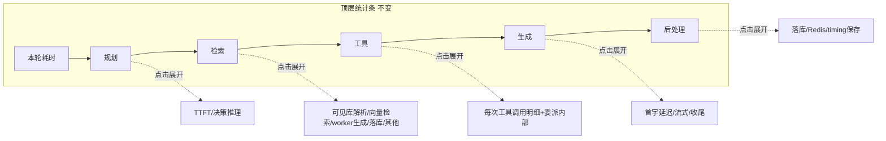

# 增量 PRD：对话各环节内部细分埋点（Sub-stage Timing Instrumentation）

| 项 | 内容 |
| --- | --- |
| 文档类型 | 增量 PRD（仅描述变更与新增部分） |
| 产品线 | ai-platform 智能体后端（FastAPI+Python） |
| 关联系统 | 现有 5 阶段对话耗时统计（前端统计条 + Redis `timings` map） |
| 作者 | 产品经理 许清楚 |
| 日期 | 2026-08-15 |
| 状态 | 评审中（Draft） |
| 技术栈约束 | 后端 FastAPI+Python（ai-platform）；前端 React+TS（mis-admin-web）；不引入新框架 |

---

## 1. 产品目标

让**运营 / 开发者**能在前端逐环节**下钻**单轮对话的耗时，定位瓶颈到底卡在哪一段，而不是只看现有的黑盒聚合值（例如现状「检索 8.64s」其实混入了 worker 生成 + 4 次 mis-kb 往返，无法区分）。

一句话目标：**把「本轮耗时 17.47s | 规划 5.24s | 检索 8.64s | 工具 9ms | 生成 12.14s | 后处理 0ms」这条统计条，从「5 个黑盒」变成「5 个可下钻的明细」。**

---

## 2. 增量范围界定

- **本次新增**：在现有 5 个父阶段（planning / retrieval / tool_call / generation / post_process）**之下各挂一组子阶段明细**，做到「被聚合之前先拆出内部子阶段」。
- **不改变**：
  - 现有 5 阶段顶层的计算口径与展示位置（前端统计条结构不变）。
  - 现有 Redis key（`aip:agent:session:{id}:timings`）、per-turn map、环形缓冲、TTL 24h。
  - `total_ms` 作为权威端到端 wall-clock 的定位。
- **增量原则**：基于现有 `session_timing.py` 计时器与 `dispatch_trace` 机制**扩展**，不推翻重做；保持「任何异常静默降级、绝不阻断主对话链路」的既有红线。

---

## 3. 现状回顾（已确认事实，直接采信）

现有 5 阶段由 `src/agent/session_timing.py` 的 `SessionTimingRecorder` 在 `AgentInstance.process_message` 外层包裹事件流推导，消费 `AgentEvent`：

| 父阶段 | 现有口径（计算方式） | 数据来源事件 | 已知问题 |
| --- | --- | --- | --- |
| `total_ms` | 进入 → 流结束端到端 wall-clock | `_start` / `_end` | 权威值，无 |
| `planning_ms` | 进入 → 首个外部动作（tool.call/dispatch.trace）或首个文本 | `DISPATCH_TRACE`/`TOOL_CALL`/`TEXT_DELTA` | 内部「TTFT vs 多轮推理」不可分 |
| `retrieval_ms` | 累加所有 `intent=rag` 的 `DISPATCH_TRACE.latency_ms` | `DISPATCH_TRACE` | **黑盒**：= mis-rag 委派整段 wall-clock，混入 worker 生成 + mis-kb 往返 |
| `tool_call_ms` | 所有 `TOOL_CALL→TOOL_RESULT` 差累加 | `TOOL_CALL`/`TOOL_RESULT` | 合并一段，不区分「网络往返 vs worker 内部」 |
| `generation_ms` | 首个文本 token → 末个文本 token 跨度 | `TEXT_DELTA` | 仅「流式持续」，首/末 token 过渡不可见 |
| `post_process_ms` | 末外部动作/末文本 → 流结束 | `DONE`/`ERROR` | 常 0ms（落库在 `finally` 异步，不在计时窗内） |

**子阶段回流的关键技术约束**（决定 retrieval / delegate 两段怎么测）：
worker（mis-rag 等）在 `agent__invoke` 工具**内部**运行，其事件流被 `_run_child_agent` 消费、**不回流**父 session 的 `SessionTimingRecorder`。因此 worker 内部细分只能经 `DispatchTraceEntry` 携带、由 `OpenHarnessRuntime` drain 成 `DISPATCH_TRACE` 事件后透传回父 recorder（详见 §5.2）。

---

## 4. 各环节细分字段清单（核心产出）

> 约定：字段名一律 `snake_case`；单位为毫秒（int，非负）；不可得为 `null`（前端显示「—」）。
> 「与父阶段关系」列标注该子阶段之和是否严格等于父阶段聚合值（用于验收对照）。

### 4.1 规划 planning（父阶段 `planning_ms`）

| 子阶段字段 | 语义 | 数据来源（谁测量 / 从哪个事件抽取） | 与父阶段关系 |
| --- | --- | --- | --- |
| `planning_ttft_ms` | **首 token 延迟**：流开始（process_message 进入）→ 首个 LLM token（首个 `TEXT_DELTA` 首帧，或首个 `TOOL_CALL` 起始——以先到者为准）。即 LLM 推理启动耗时。 | recorder 已有 `_start` + 首个 `TEXT_DELTA`/`TOOL_CALL` 时间戳 | `planning_ttft_ms + planning_decision_ms = planning_ms`（严格） |
| `planning_decision_ms` | **决策推理**：首个 LLM token → 首个外部动作（tool.call / dispatch.trace）或首个文本之间的剩余推理（多步 thinking / 二次采样）。 | recorder 首个 token 时间戳 → 首个 `DISPATCH_TRACE`/`TOOL_CALL` 时间戳 | 同上 |

> ⚠️ `planning_decision_ms` 仅在运行时暴露「首 token vs 决策完成」的区分事件时可测；若运行时不暴露中间 LLM 事件，则该段恒为 `null`（不影响 `planning_ttft_ms` 与 `planning_ms` 对照）。列为**可选子阶段**，P0 至少保证 `planning_ttft_ms`。

### 4.2 检索 retrieval（父阶段 `retrieval_ms`，黑盒拆分重点）

> 数据来源：`DispatchTraceEntry.sub_stages`（mis-rag worker 内部 `qa_pipeline` 自测后经 `DISPATCH_TRACE` 透传；见 §5.2）。4 段之和应 ≈ `retrieval_ms`（整段 mis-rag 委派 wall-clock）。

| 子阶段字段 | 语义 | 数据来源（谁测量 / 从哪个事件抽取） | 与父阶段关系 |
| --- | --- | --- | --- |
| `resolve_visible_libraries_ms` | **可见库解析**：判定当前用户可见知识库范围（1 次 mis-kb HTTP 往返 `resolve_visible_libraries`）。 | mis-rag `qa_pipeline.retrieve_kb_chunks` 内 `kb.resolve_visible_libraries` 前后 `perf_counter` | `resolve + RAGFlow + worker_generate + persist + overhead ≈ retrieval_ms` |
| `RAGFlow_retrieve_ms` | **真向量检索**：RAGFlow 召回 chunk（1 次 mis-kb HTTP 往返 `POST /internal/v1/kb/rag/retrieve`）。 | `qa_pipeline._retrieve` → `kb.retrieve` 前后计时 | 同上 |
| `worker_generate_ms` | **worker 内部 LLM 生成**：拼 prompt 后调 LLM 生成答案（黑盒，经注入的 `generate` 回调包裹计时）。 | `qa_pipeline.run` 的 `generate(prompt)` 回调前后计时 | 同上 |
| `persist_ms` | **落库**：回调 mis-kb 落库（多次往返：`create_session` + `append_message(user)` + `append_message(assistant)` + `save_citations`）。 | `qa_pipeline._persist` 前后计时 | 同上 |
| `overhead_ms` | **其他开销**：prompt 构建（`_build_prompt` CPU 拼接）+ 序列化/反序列化等不可归类的微小项。 | `qa_pipeline.run` 段内其余部分 | 差值校验项（见 §9 验收） |

> 注：`_build_prompt` 为 CPU 拼接、耗时极低，可并入 `overhead_ms` 或归入 `worker_generate_ms` 边界，由实现期裁定；PRD 仅要求 4 个主段可独立测量、其和与 `retrieval_ms` 可对照。

### 4.3 工具 tool_call（父阶段 `tool_call_ms`）

> 结构变更：从「单值累加」改为**按调用分别计时**的数组 + 委派类型区分。数据来源：recorder 已有的 `TOOL_CALL`/`TOOL_RESULT` 压栈配对（改造成记录每对的 `tool_name` + `latency_ms`）。

| 子阶段字段 | 语义 | 数据来源 | 与父阶段关系 |
| --- | --- | --- | --- |
| `calls[]` | 每个工具调用的独立明细数组，元素：`{tool_name, kind, latency_ms, sub_stages?}` | 每对 `TOOL_CALL`→`TOOL_RESULT` | `Σ calls[].latency_ms = tool_call_ms`（严格） |
| `calls[].tool_name` | 工具名（如 `agent__invoke`、`kb_retrieve`、业务工具） | `TOOL_CALL.tool_name` | — |
| `calls[].kind` | 调用类别：`delegate`（委派类，如 `agent__invoke`）/ `native`（普通工具） | 工具名匹配白名单或事件标记 | — |
| `calls[].latency_ms` | 该次调用的 wall-clock（TOOL_CALL→TOOL_RESULT） | recorder 配对差 | 累加 = `tool_call_ms` |
| `calls[].sub_stages` | 仅 `delegate` 类携带：该 worker 内部的 `sub_stages`（结构同 §4.2，来自 `DispatchTraceEntry.sub_stages`）。用于区分「网络/委派往返」与「worker 内部处理」 | `DISPATCH_TRACE` 透传 | — |
| `delegate_round_trip_ms` | **委派往返**（辅助指标）：父 agent → 子 agent 的网络委派 + 会话创建/初始化开销 ≈ `calls[].latency_ms - Σ calls[].sub_stages`（近似，因 sub_stages 为 worker 内部） | 由 `InvokeAgentTool` 内 pre-worker 计时或差值推算 | 辅助定位，非严格求和项 |

### 4.4 生成 generation（父阶段 `generation_ms`）

> 数据来源：recorder 已有 `_first_text` / `_last_text` / `_start` / `_end` 时间戳。
> **口径说明**：现有 `generation_ms`（首文本→末文本）是权威值、不变。`generation_stream_ms` 即等于它；`generation_ttft_ms` / `generation_tail_ms` 为跨段辅助定位指标（不与 `generation_ms` 严格求和，详见 §9）。

| 子阶段字段 | 语义 | 数据来源 | 与父阶段关系 |
| --- | --- | --- | --- |
| `generation_ttft_ms` | **首 token 延迟（全局）**：流开始 → 首个文本 token。定位「用户等多久才看到第一个字」。 | `_start` → `_first_text` | 与 `planning_ms` 衔接（若规划以文本结束则≈`planning_ms`）；辅助指标 |
| `generation_stream_ms` | **流式持续**：首个文本 token → 末个文本 token。 | `_first_text` → `_last_text` | **= 现有 `generation_ms`（权威，不变）** |
| `generation_tail_ms` | **末 token 收尾**：末个文本 token → 流结束（done 前）的格式化/解析收口。 | `_last_text` → `_end` | 与 `post_process_ms` 边界重叠，属收尾段（辅助指标） |

### 4.5 后处理 post_process（父阶段 `post_process_ms`）

> ⚠️ **重要发现**：现状 `post_process_ms` 常显示 `0ms`，因为落库（`session.save` / Redis 写入）发生在 `manager.process_message` 的 `finally` 里，而 recorder 在 `DONE` 事件即 `complete()`，**计时窗早于落库完成**。要测到子阶段，需把计时窗延伸到 `finally` 落库各步（或 finally 内分步打点）。详见 §5.3 与待确认 Q5。

| 子阶段字段 | 语义 | 数据来源（谁测量） | 与父阶段关系 |
| --- | --- | --- | --- |
| `db_persist_ms` | 落库（PG session/message 写入） | `manager.finally` 内 `session_manager.save_session` 前后打点 | `db + redis + timing_save ≈ post_process_ms`（严格，需 §5.3 计时窗延伸） |
| `redis_write_ms` | Redis 写入（消息/状态） | `finally` 内 Redis 写入前后打点 | 同上 |
| `timing_save_ms` | timing 保存（本模块 `RedisTimingStore.save`） | recorder 在 `store.save` 调用前后计时 | 同上 |

---

## 5. 子阶段数据来源与回流机制

### 5.1 主 agent 内部子阶段（planning / generation / post_process / tool_call 配对）

`SessionTimingRecorder` 已持有 `_start` / `_first_text` / `_last_text` / `_end` 及 `TOOL_CALL` 压栈配对，无需新增事件即可推导 §4.1/§4.4/§4.3 的大部分字段。仅改动：
- 记录每对 `TOOL_CALL→TOOL_RESULT` 的 `tool_name` 与独立 `latency_ms`（现状只累加，不记录名）。
- `post_process` 子阶段需 `manager.process_message` 在 `finally` 落库各步前后打点（§5.3）。

### 5.2 worker 内部子阶段回流（retrieval 4 段 + delegate 的 sub_stages）

```mermaid
flowchart TD
    A[mis-rag qa_pipeline.run] -->|perf_counter 自测 4 段| B[sub_stages 字典]
    B --> C[_run_child_agent / InvokeAgentTool._finish]
    C -->|写 DispatchTraceEntry.sub_stages| D[push_dispatch_trace 缓冲]
    D --> E[OpenHarnessRuntime.drain_dispatch_traces]
    E -->|yield AgentEvent.dispatch_trace| F[SessionTimingRecorder.observe]
    F -->|intent=rag 提取 sub_stages| G[snapshot.sub_stages.retrieval]
    F -->|非 rag delegate 提取 sub_stages| H[snapshot.sub_stages.tool_call.calls[].sub_stages]
```

- **新增字段**：`DispatchTraceEntry.sub_stages: dict | None`（可选，缺省 `null`，向后兼容既有 trace 结构）。
- mis-rag worker 在 `qa_pipeline.run` / `run_stream` 内用 `perf_counter` 测 `resolve_visible_libraries_ms` / `RAGFlow_retrieve_ms` / `worker_generate_ms` / `persist_ms` / `overhead_ms`，经返回值或 contextvar 传回 `InvokeAgentTool._finish`，填入 `DispatchTraceEntry.sub_stages`。
- `SessionTimingRecorder.observe(DISPATCH_TRACE)` 扩展：除累加 `latency_ms` 到 `retrieval_ms` 外，额外提取 `intent=rag` 条目的 `sub_stages` → `snapshot.sub_stages.retrieval`；其余 worker 的 `sub_stages` 挂到对应 `tool_call.calls[]` 明细（P2 通用化基础）。
- `dispatch_trace` 默认开启（`DISPATCH_TRACE_EVENT_ENABLED=True`），现有 `retrieval_ms` 已依赖此通道，扩展无回归风险。

### 5.3 后处理计时窗延伸

`AgentInstance.process_message` 的 `finally` 当前顺序：`落库(save_session)` → `RedisTimingStore.save(timing)`。建议在 `finally` 内各步前后由 recorder 记录 `db_persist_ms` / `redis_write_ms` / `timing_save_ms`（recorder 新增弱引用打点方法，异常静默）。这样 `post_process_ms` 计时窗从「DONE 事件」延伸到「落库完成」，子阶段之和才严格等于父阶段。

---

## 6. 数据存储与 schema 扩展

**评估**：现有 Redis `timings` map 结构**够用**，仅需在其值（per-turn snapshot）内新增一个 `sub_stages` 顶层对象，不破坏 `stages` 与 `turn_key` 索引。

- 升级 `TIMING_SCHEMA_VERSION`: 1 → **2**（读取端对 `sub_stages` 缺失优雅降级为「—」，旧前端/旧数据零回归）。
- per-turn snapshot 新结构（节选）：

```json
{
  "turn_key": "asst-msg-id",
  "total_ms": 17470,
  "stages": {
    "planning_ms": 5240,
    "retrieval_ms": 8640,
    "tool_call_ms": 9,
    "generation_ms": 12140,
    "post_process_ms": 41
  },
  "sub_stages": {
    "planning":   { "ttft_ms": 4120, "decision_ms": 1120 },
    "retrieval":  {
      "resolve_visible_libraries_ms": 320,
      "RAGFlow_retrieve_ms": 1850,
      "worker_generate_ms": 5600,
      "persist_ms": 870,
      "overhead_ms": 0
    },
    "tool_call":  {
      "calls": [
        { "tool_name": "agent__invoke", "kind": "delegate", "latency_ms": 8642,
          "sub_stages": { "resolve_visible_libraries_ms": 320, "RAGFlow_retrieve_ms": 1850,
                          "worker_generate_ms": 5600, "persist_ms": 870, "overhead_ms": 0 } }
      ],
      "delegate_round_trip_ms": 2
    },
    "generation": { "ttft_ms": 80, "stream_ms": 12010, "tail_ms": 50 },
    "post_process": { "db_persist_ms": 33, "redis_write_ms": 5, "timing_save_ms": 3 }
  },
  "schema_version": 2,
  "sampled_at": "2026-08-15T..."
}
```

- Redis key / TTL / 环形缓冲（50 轮）/ `last` 兼容字段：**全部不变**。
- `DispatchTraceEntry` 新增 `sub_stages` 字段（`ConfigDict(extra="ignore")` 已支持，向后兼容）。

---

## 7. 前端展示方案

**推荐方案（待确认项，默认推荐）**：保持现有顶层 5 阶段统计条不变，在阶段条下方以**可折叠次级行**展示子阶段明细。

- 顶层（`agent-message-stream.tsx` 251-264 行）5 阶段 `InlineTimingCell` 不变。
- 每个阶段 `cell` 变为**可点击**，点击展开该阶段的子阶段明细行（同 `fmtMs` 渲染，标注各子段 ms）。
- retrieval 展开示例：`检索 8.64s ▸ 可见库解析 320ms · 向量检索 1.85s · worker生成 5.6s · 落库 870ms · 其他 0ms`。
- 提供全局「展开全部耗时明细」开关；**默认折叠**（避免刷屏，长会话性能友好）。
- **对照校验展示**：子阶段之和与父阶段聚合值偏差 > 5% 时，父阶段 cell 标黄提示（如 `检索 8.64s ⚠`），便于发现口径漂移。
- 前端 `SessionTiming` / `StageTiming` 类型（`features/agent/types`）同步扩展 `sub_stages` 字段；旧数据 `sub_stages` 缺省显示为「—」。



---

## 8. 需求池（P0 / P1 / P2）

### P0 — 后端细分埋点 + 存储扩展（本论必做）

| ID | 需求 | 验收 |
| --- | --- | --- |
| P0-1 | `DispatchTraceEntry` 新增 `sub_stages`；mis-rag `qa_pipeline` 内部 4 段（`resolve_visible_libraries`/`RAGFlow_retrieve`/`worker_generate`/`persist`）+ `overhead`）自测并回填 | rag worker 4 段可独立测量 |
| P0-2 | `SessionTimingRecorder` 提取并透传 `retrieval.sub_stages`（从 `DISPATCH_TRACE`）；新增 `planning_ttft_ms`/`planning_decision_ms`/`generation_ttft_ms`/`generation_stream_ms`/`generation_tail_ms` 计时 | 上述字段能从现有事件推导 |
| P0-3 | `tool_call` 改为按调用分别计时（`calls[]`，含 `tool_name`/`kind`/`latency_ms`），delegate 类挂 `sub_stages` | `Σ calls[].latency_ms = tool_call_ms` |
| P0-4 | Redis schema 升级 `TIMING_SCHEMA_VERSION=2`，snapshot 加 `sub_stages`；`post_process` 子阶段经 `finally` 分步打点（`db_persist_ms`/`redis_write_ms`/`timing_save_ms`） | 子阶段之和≈`post_process_ms` |

### P1 — 前端展示子阶段（下钻体验）

| ID | 需求 | 验收 |
| --- | --- | --- |
| P1-1 | 前端 `types` 扩展 `sub_stages`；旧数据缺省「—」 | 类型对齐、零回归 |
| P1-2 | `agent-message-stream.tsx` 渲染可折叠子阶段次级行，顶层 5 阶段不变 | 点击阶段可下钻 |
| P1-3 | 子阶段之和与父阶段对照校验，偏差 >5% 父 cell 标黄 | 口径漂移可见 |

### P2 — 跨 agent 通用化（后续演进）

| ID | 需求 |
| --- | --- |
| P2-1 | 不只是 rag，所有 worker（crm / extract / summary）子阶段埋点通用化（复用 `DispatchTraceEntry.sub_stages`） |
| P2-2 | 不只是 copilot，所有 agent 的计时器通用（当前 recorder 已挂全部 agent 的 `process_message`；明确非 rag 委派归入 `tool_call`） |
| P2-3 | 埋点开关（feature flag），应对性能开销考量（高频会话可降级关闭子阶段采集） |

---

## 9. 验收标准

1. **可独立测量**：§4 中每个子阶段字段都有明确数据来源（事件 / trace / finally 打点），能被独立采集，不可得时为 `null` 而非 0。
2. **可前端下钻**：P1 完成后，运营能在前端点击任一父阶段展开其子阶段明细，定位瓶颈段。
3. **可对照（严格求和项）**：
   - `planning_ttft_ms + planning_decision_ms = planning_ms`
   - `Σ tool_call.calls[].latency_ms = tool_call_ms`
   - `db_persist_ms + redis_write_ms + timing_save_ms ≈ post_process_ms`（P0-4 计时窗延伸后）
   - `resolve_visible_libraries_ms + RAGFlow_retrieve_ms + worker_generate_ms + persist_ms + overhead_ms ≈ retrieval_ms`（偏差应 < 5%，否则 `overhead_ms` 吸收）
   - `generation_stream_ms = generation_ms`（权威不变）
4. **零回归**：现有顶层 5 阶段展示、Redis 结构、TTL/环形缓冲、降级红线均不受影响；`schema_version<2` 旧数据前端显示「—」不报错。
5. **降级安全**：子阶段采集异常一律静默降级，绝不阻断主对话链路（沿用 `session_timing` 现有 `try/except` 范式）。

---

## 10. 待确认问题（Open Questions）

1. **前端展示粒度**：默认折叠 vs 默认展开？移动端（运营台 H5）是否展示子阶段？是否需要「全局展开」开关？→ 推荐默认折叠 + 全局开关。
2. **是否所有 agent 通用**：本次 P0 仅保证 copilot 路径 + rag 子阶段；crm/extract/summary 子阶段与「所有 agent 通用」是否进本期（建议留 P2）？
3. **埋点开关**：高频会话是否需要 feature flag 关闭子阶段采集以控性能开销（建议 P2，但开关设计本期预留）？
4. **`worker_generate_ms` 测量点**：`generate` 是注入回调，是否允许在 `qa_pipeline` 内用装饰器/包裹计时（不改 LLM 网关）？需在实现期确认回调包裹方式。
5. **`post_process` 计时窗**：是否接受把 recorder 计时窗延伸到 `finally` 落库完成（P0-4）？还是仅测 `timing_save` 一段、其余留 P2？现状常 0ms 的根因即在此。
6. **`planning_decision_ms` 可测性**：运行时若不暴露「首 token vs 决策完成」的中间事件，该段恒 `null`——是否接受（P0 仅保证 `planning_ttft_ms`）？
7. **retrieval 4 段与 `latency_ms` 口径对齐**：`overhead_ms` 的归属（并入 `worker_generate` 还是独立展示）由实现期裁定，PRD 要求「4 主段可独立测量 + 其和可对照」即可。
8. **delegate 往返拆分精度**：`delegate_round_trip_ms` 为「工具 latency − worker sub_stages 和」的近似；是否需要在 `InvokeAgentTool` 内单独测 pre-worker 编排耗时以精确化（建议精确化，列为 P0-3 增强）？

---

## 11. 附录：本轮耗时拆分对照示例（基于背景数据推演）

```
本轮耗时 17.47s
├ 规划 5.24s
│   ├ TTFT 4.12s
│   └ 决策推理 1.12s
├ 检索 8.64s  ← 现状黑盒
│   ├ 可见库解析 0.32s
│   ├ 向量检索(RAGFlow) 1.85s
│   ├ worker生成 5.60s
│   ├ 落库(mis-kb×N) 0.87s
│   └ 其他开销 0.00s
├ 工具 9ms
│   └ agent__invoke ×1 : 8.64s (delegate) → 内部见「检索」4 段；往返 ~2ms
├ 生成 12.14s
│   ├ 首字延迟 0.08s
│   ├ 流式持续 12.01s   (= generation_ms)
│   └ 末 token 收尾 0.05s
└ 后处理 0ms → 延伸计时窗后 ~41ms
    ├ 落库(PG) 33ms
    ├ Redis 写入 5ms
    └ timing 保存 3ms
```

> 说明：检索 8.64s 与工具 9ms 中的 `agent__invoke` 为同一段委派（rag worker）的两面——`retrieval_ms` 从 `DISPATCH_TRACE` 取 rag 意图，`tool_call_ms` 从 `TOOL_CALL/TOOL_RESULT` 取同一调用；两者数值接近但口径不同（前者含 worker 全流程、后者为该工具 wall-clock）。前端展开时两者 sub_stages 同源，避免重复计数的歧义需在 UI 文案注明。
