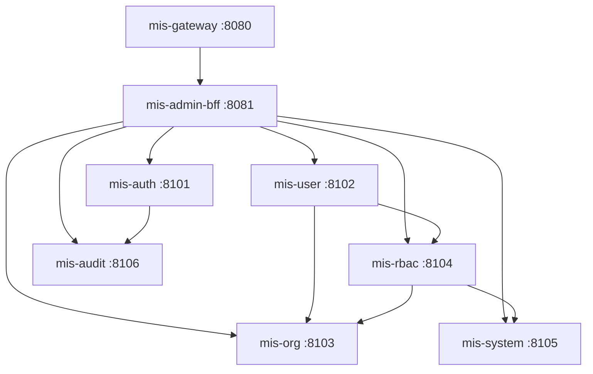

# MIS Platform — 项目模块说明

> 状态：📝 草稿 | 版本：v1.0 | 最后更新：2026-07-14  
> 本文档说明仓库内**每个子项目/模块**的职责、内容与实现状态，便于 onboarding 与分工。

---

## 1. 仓库总览

**MIS Platform** 是一个 Monorepo，面向企业内部统一管理与协作，包含管理后台、Java 微服务后端、部署配置与规格文档。

```
mis-platform/
├── backend/                 # Java 17 + Spring Boot 3 微服务
├── frontend/                # React 管理后台
├── deploy/                  # Docker Compose、Nacos、环境配置
├── docs/                    # 架构/API/数据库等规格文档
├── scripts/                 # 本地初始化与运维脚本
├── .env.example             # 环境变量模板
└── README.md                # 仓库入口
```

### 1.1 技术栈摘要

| 层级 | 技术 |
|------|------|
| 前端 | React 18、TypeScript、Vite、Zustand、Axios |
| 后端 | JDK 17、Spring Boot 3.2、Spring Cloud Gateway、Spring Data JPA |
| 数据库 | PostgreSQL 16（Phase 1 单库 `mis_platform`） |
| 缓存 | Redis 7.2（验证码、Token 黑名单、权限缓存等） |
| 注册/配置 | Nacos 2.3（可选，本地默认不连） |
| 对象存储 | MinIO（Phase 2 文件中心预留） |
| 智能体 | Python + FastAPI（Phase 1 骨架，目录 `agent/` 待建） |

### 1.2 当前开发阶段

**Sprint 1 — 认证闭环**：已实现 Gateway、Auth、Audit 与前端登录页；BFF 与业务领域服务（user/org/rbac/system）尚未创建。

---

## 2. 后端模块（backend/）

Maven 多模块工程，父 POM：`backend/pom.xml`（`com.mis:mis-platform:0.1.0-SNAPSHOT`）。

### 2.1 模块总览

| 模块 | artifactId | 端口 | 类型 | 状态 | 一句话说明 |
|------|------------|------|------|------|------------|
| 数据库迁移 | mis-migrator | — | 工具 | ✅ 已实现 | Flyway 统一管理全库表结构与种子数据 |
| 公共库 | mis-common | — | 库 | ✅ 已实现 | 跨服务共享的核心、安全、JPA、Web、Redis 能力 |
| API 网关 | mis-gateway | 8080 | 服务 | ✅ 已实现 | 路由、JWT 验签、黑名单、身份头透传 |
| 认证服务 | mis-auth | 8101 | 服务 | ✅ 已实现 | 登录、验证码、Token 签发/刷新/登出 |
| 审计服务 | mis-audit | 8106 | 服务 | ✅ 已实现 | 登录日志写入与查询 |
| 管理 BFF | mis-admin-bff | 8081 | 服务 | ⏳ 待建 | 前端 API 聚合、DTO 适配、API 权限校验 |
| 用户服务 | mis-user | 8102 | 服务 | ⏳ 待建 | 用户/员工 CRUD、角色分配、密码重置 |
| 组织服务 | mis-org | 8103 | 服务 | ⏳ 待建 | 组织树 CRUD、ancestors 维护、子树查询 |
| 权限服务 | mis-rbac | 8104 | 服务 | ⏳ 待建 | 角色、菜单分配、权限聚合与 Redis 缓存 |
| 系统服务 | mis-system | 8105 | 服务 | ⏳ 待建 | 菜单、字典、系统参数、API 元数据 |
| 通知服务 | mis-notify | 8107 | 服务 | ⏳ 骨架 | Phase 1 仅占位，Phase 2 实现消息中心 |

---

### 2.2 mis-migrator — 数据库迁移

**路径：** `backend/mis-migrator/`

**作用：** Phase 1 采用**单库策略**（ADR-001），所有微服务共享 `mis_platform` 数据库；表结构变更**仅**通过本模块的 Flyway 脚本管理，业务服务启动时不执行迁移。

**主要内容：**

| 路径 | 说明 |
|------|------|
| `src/main/resources/db/migration/V1__init_schema.sql` | 建表、索引、枚举约束 |
| `src/main/resources/db/migration/V2__seed_data.sql` | 种子数据（admin、菜单、角色等） |
| `docs/db/migrations/` | 设计评审副本（修改后需同步到 migrator） |

**常用命令：**

```bash
cd backend
mvn -pl mis-migrator flyway:migrate    # 执行迁移
mvn -pl mis-migrator flyway:info       # 查看状态
```

**默认测试账号（V2 种子）：**

| 账号 | 密码 | 说明 |
|------|------|------|
| admin | Mis@123456 | 租户管理员（app=system） |
| superadmin | Mis@123456 | 平台管理员 |

---

### 2.3 mis-common — 公共模块

**路径：** `backend/mis-common/`

**作用：** 被各微服务以 Maven 依赖方式引入，提供统一响应格式、安全上下文、JPA 基类、Redis 封装、全局异常与链路追踪等横切能力。**不包含**可独立启动的业务逻辑。

#### 2.3.1 mis-common-bom

**路径：** `backend/mis-common/mis-common-bom/`

**作用：** Maven BOM（Bill of Materials），集中管理 Spring Boot、Spring Cloud、内部模块版本，父工程通过 `dependencyManagement` 引入，避免各服务版本漂移。

#### 2.3.2 mis-common-core

**路径：** `backend/mis-common/mis-common-core/`

**作用：** 最底层公共类型与工具，无 Spring Web 依赖。

| 包/类 | 职责 |
|-------|------|
| `Result<T>` / `PageResult<T>` | 统一 API 响应与分页结构 |
| `BusinessException` / `ResultCode` | 业务异常与错误码枚举 |
| `SecurityConstants` | Token 头、Cookie 名、透传头常量 |
| `CommonConstants` | 通用状态、删除标记 |
| `CacheConstants` | Redis Key 前缀规范 |
| `TraceConstants` | MDC traceId 键名 |
| `TraceIdUtils` | 生成 32 位 hex 链路 ID |

#### 2.3.3 mis-common-security

**路径：** `backend/mis-common/mis-common-security/`

**作用：** 认证授权基础设施，供 Gateway（WebFlux）与 Servlet 微服务共用。

| 包/组件 | 职责 |
|---------|------|
| `jwt.RsaJwtVerifier` / `RsaJwtIssuer` | RS256 JWT 验签与签发 |
| `jwt.TokenBlacklistChecker` | jti 黑名单检查接口 |
| `filter.GatewayContextFilter` | Servlet 侧解析 Gateway 注入的 `X-User-Id` 等头 |
| `context.LoginUser` / `SecurityContextHolder` | 当前登录用户 ThreadLocal 上下文 |
| `audit.LoginUserAuditorAware` | JPA 审计字段自动填充操作人 |
| `support.LoginUserHeaderResolver` | 从 HTTP 头构建 LoginUser |

**安全分层：**

| 层级 | 模块 | 职责 |
|------|------|------|
| L0 | mis-auth | 登录、JWT 签发、Refresh、登出写黑名单 |
| L1 | mis-gateway | JWT 验签、查黑名单、透传身份头 |
| L2 | mis-admin-bff（待建） | API 级权限（Redis permissions） |
| L3 | 领域服务 | 读透传头、`@DataScope` 数据权限 |

#### 2.3.4 mis-common-redis

**路径：** `backend/mis-common/mis-common-redis/`

**作用：** Redis 自动配置与认证/权限相关缓存封装。

| 组件 | 职责 |
|------|------|
| `TokenBlacklistService` | 写入/查询 `mis:auth:token:blacklist:{jti}` |
| `RedisTokenBlacklistChecker` | Gateway 使用的黑名单实现 |
| `PermVersionService` | 权限版本号同步（DB ↔ Redis） |
| `MisRedisAutoConfiguration` | Spring Boot 自动配置 |

**典型 Redis Key：**

```
mis:auth:captcha:{id}              # 验证码，TTL 300s
mis:auth:login:fail:{username}     # 登录失败计数，TTL 30min
mis:auth:token:blacklist:{jti}      # 登出黑名单
mis:auth:refresh:{hash}            # Refresh Token
mis:rbac:permissions:{userId}      # 用户权限缓存，TTL 15min
mis:rbac:perm-version:{tenant}:{app}:{userId}  # 权限版本
```

#### 2.3.5 mis-common-jpa

**路径：** `backend/mis-common/mis-common-jpa/`

**作用：** Spring Data JPA 公共能力（ADR-015：选用 JPA 而非 MyBatis）。

| 组件 | 职责 |
|------|------|
| `BaseEntity` | 创建/更新人、时间、软删除字段 |
| `PageMapper` | `Page<T>` → `PageResult<T>` |
| `@DataScope` | 数据权限注解 |
| `DataScopeSpecification` | 按角色 data_scope 生成 JPA Specification |
| `DefaultAuditorAware` | JPA 审计默认实现 |

**数据范围（data_scope）策略：**

| 值 | 含义 |
|----|------|
| 1 SCOPE_ALL | 全部数据 |
| 2 SCOPE_DEPT | 本部门 |
| 3 SCOPE_DEPT_AND_CHILD | 本部门及下级 |
| 4 SCOPE_SELF | 仅本人创建 |
| 5 SCOPE_CUSTOM | 自定义 org/dept |
| 6 SCOPE_ORG | 按组织 |

#### 2.3.6 mis-common-web

**路径：** `backend/mis-common/mis-common-web/`

**作用：** **仅 Servlet MVC 服务**使用；Gateway（WebFlux）不依赖本模块。

| 组件 | 职责 |
|------|------|
| `TraceIdFilter` | 读取或生成 traceId，写入 MDC 与响应头 |
| `GlobalExceptionHandler` | 统一异常 → `Result` 响应 |
| `MisWebAutoConfiguration` | 自动注册 Filter 与异常处理器 |
| `@OperLog`（待实现） | 操作日志 AOP，采集后调 mis-audit |

#### 2.3.7 mis-common-client（规划中）

**文档位置：** [common-modules.md](../backend/common-modules.md)

**作用：** 服务间 HTTP 客户端工厂（ADR-007：不用 OpenFeign）。BFF 用 WebClient 并行聚合；领域服务用 RestClient 串行调用。Phase 1 尚未创建该子模块。

---

### 2.4 mis-gateway — API 网关

**路径：** `backend/mis-gateway/`  
**端口：** `8080`

**作用：** 系统唯一对外 HTTP 入口（前端与外部客户端均经此访问），负责接入层安全与路由，**不写业务逻辑、不访问数据库**。

**核心能力：**

| 能力 | 说明 |
|------|------|
| JWT 验签 | RS256 公钥验签 Access Token |
| 黑名单 | 通过 Redis 检查 jti，拒绝已登出 Token |
| 身份透传 | 验签成功后注入 `X-User-Id`、`X-Tenant-Id`、`X-App-Id`、`X-Employee-Id`、`X-Username`、`X-Trace-Id` |
| 白名单 | 登录、刷新、验证码、健康检查等路径免认证 |
| CORS | 开发环境允许 `localhost:5173` |
| 路由 | Phase 1 规划：`/api/v1/**` → mis-admin-bff（BFF 待建时可能直连 auth） |

**关键类：** `JwtAuthenticationGlobalFilter`、`GatewaySecurityConfiguration`

---

### 2.5 mis-auth — 认证服务

**路径：** `backend/mis-auth/`  
**端口：** `8101`

**作用：** 用户身份认证与 Token 生命周期管理（L0 安全层），是**唯一持有 JWT 私钥**的服务。

**核心能力：**

| API | 方法 | 说明 |
|-----|------|------|
| `/api/v1/auth/captcha` | GET | 图形验证码 |
| `/api/v1/auth/login` | POST | 验证码 + 密码校验，签发 Access Token，Set-Cookie Refresh |
| `/api/v1/auth/refresh` | POST | 刷新 Access Token |
| `/api/v1/auth/logout` | POST | 吊销 Refresh，Access Token jti 入黑名单 |

**业务规则：**

- 连续错误密码 5 次 → 账号锁定 30 分钟（Redis 计数）
- Refresh Token 存 Cookie（HttpOnly），Access Token 由前端存储
- 登录成功后异步调用 mis-audit 写登录日志
- JWT **不含** permissions 列表（权限由 BFF 从 Redis 加载，ADR-009）

**依赖：** PostgreSQL（用户表、Refresh Token 表）、Redis、mis-audit（登录日志）

**关键包：**

```
com.mis.auth/
├── controller/AuthController.java
├── service/AuthService, CaptchaService, LoginLockService, RefreshTokenService
├── domain/entity/          # SysUser, SysEmployee, RefreshTokenEntity 等
├── client/AuditLoginLogClient.java
└── support/TokenUtils.java
```

---

### 2.6 mis-audit — 审计服务

**路径：** `backend/mis-audit/`  
**端口：** `8106`

**作用：** 登录与操作日志的采集、存储与查询，支撑合规审计。

**Phase 1 已实现：**

| API | 说明 |
|-----|------|
| `POST /internal/v1/login-logs` | mis-auth 内部写入登录日志 |
| `GET /internal/v1/login-logs` | 内部分页查询 |
| `GET /api/v1/audit/login-logs` | 对外分页查询（经 Gateway） |

**Phase 1 后续 / Sprint 4：**

- `@OperLog` AOP 采集操作日志
- 操作日志分页查询 API
- 敏感字段脱敏（手机号、密码等）

**实体：** `SysLoginLog`（登录 IP、User-Agent、成功/失败、时间等）

---

### 2.7 mis-admin-bff — 管理后台 BFF（待建）

**规划路径：** `backend/mis-admin-bff/`  
**规划端口：** `8081`

**作用：** Backend For Frontend，专为 `mis-admin-web` 提供聚合 API，是前端**唯一**应对接的业务 API 层（除认证等特殊路径外）。

**职责：**

| 对外 Controller | 聚合服务 |
|-----------------|----------|
| AuthController | mis-auth |
| UserController | mis-user + mis-rbac |
| OrgController | mis-org |
| RoleController | mis-rbac + mis-system |
| MenuController | mis-system |
| DictController | mis-system |
| AuditController | mis-audit |
| DashboardController | mis-user + mis-org + mis-audit |

**设计原则：**

- 适配前端 DTO（camelCase），减少前端多次请求
- API 权限：`ApiPermissionInterceptor` + Redis permissions（ADR-011）
- 不写核心业务规则，规则留在领域服务
- 使用 WebClient 并行调用下游服务（ADR-007）

---

### 2.8 mis-user — 用户服务（待建）

**规划端口：** `8102`

**作用：** 用户与员工主数据管理，限界上下文为「系统用户」。

| 能力 | 说明 |
|------|------|
| 用户 CRUD | 含软删除、分页、部门筛选 |
| 员工档案 | `sys_employee` 主数据 |
| 登录账号 | `sys_user`（每 APP 每员工一条） |
| 状态管理 | 启用 / 禁用 / 锁定 |
| 重置密码 | BCrypt 哈希写入 |
| 角色分配 | 调用 mis-rbac 或写 `sys_user_role` |

**业务规则：** 不能删除自己；不能删除最后一个 ADMIN；username 租户内唯一。

---

### 2.9 mis-org — 组织服务（待建）

**规划端口：** `8103`

**作用：** 组织架构（部门）树形管理，为数据权限提供部门子树 ID。

| 能力 | 说明 |
|------|------|
| 组织树查询 | 递归或一次查 + 内存组树 |
| CRUD | 维护 `ancestors` 字段 |
| 子树 ID 列表 | 供 DataScope 过滤使用 |

**删除规则：** 有子部门或有用户关联时拒绝删除。

---

### 2.10 mis-rbac — 权限服务（待建）

**规划端口：** `8104`

**作用：** 权限策略中心（PDP），管理角色、菜单分配、数据范围，并聚合用户权限写入 Redis。

| 能力 | 说明 |
|------|------|
| 角色 CRUD | |
| 角色-菜单分配 | |
| 数据范围 | `sys_role_permission`（perm_type=dept/org） |
| 用户权限聚合 | DB 聚合 → Redis 缓存，变更时 evict |
| 用户角色绑定 | |

**内部 API 示例：**

- `GET /internal/v1/permissions/{userId}` — 登录/刷新时加载权限
- `POST /internal/v1/authz/check` — 调试用

---

### 2.11 mis-system — 系统服务（待建）

**规划端口：** `8105`

**作用：** 系统级元数据与配置管理。

| 能力 | 说明 |
|------|------|
| 菜单 CRUD | 目录 / 菜单页 / 按钮 |
| API 元数据 | `sys_api` 树 + `sys_menu_api` 关联 |
| 动态路由 | `GET /menus/router` 供前端注册路由 |
| API Registry | 供 BFF 加载权限映射表 |
| 字典 | 类型 + 字典项 CRUD |
| 系统参数 | `sys_config` |

---

### 2.12 mis-notify — 通知服务（待建，Phase 1 骨架）

**规划端口：** `8107`

**作用：** Phase 1 仅保留健康检查与模块占位；Phase 2 实现站内信、邮件、企微/钉钉推送。

---

### 2.13 服务间调用关系



**约定：**

- 外部 API：Gateway → BFF → `/api/v1/*`
- 内部 API：服务间 `/internal/v1/*`，直连不经 Gateway
- BFF 使用 WebClient；领域服务使用 RestClient（不用 Feign）

---

## 3. 前端模块（frontend/）

### 3.1 mis-admin-web — 管理后台

**路径：** `frontend/mis-admin-web/`  
**开发端口：** `5173`（Vite）

**作用：** Phase 1 企业管理后台 SPA，提供登录、布局、业务页面与权限展示。所有 API 经 Vite 代理到 Gateway `http://localhost:8080`，**不直连**各微服务。

**技术栈：** React 18、TypeScript、Vite 5、Zustand、Axios、React Router

**目录结构：**

```
src/
├── app/
│   ├── App.tsx              # 根组件
│   └── router.tsx           # 路由定义
├── features/
│   └── auth/
│       └── login-page.tsx   # 登录页 + Dashboard 占位
├── components/
│   └── auth/
│       └── protected-route.tsx  # 路由守卫
├── stores/
│   └── auth-store.ts        # 登录态、Token 持久化
├── lib/
│   └── api/
│       ├── client.ts        # Axios 实例、拦截器、Refresh 单飞锁
│       └── auth.ts          # 认证 API 封装
├── types/
│   └── api.ts               # API 类型定义
└── styles/
    └── globals.css          # 全局样式
```

**Phase 1 已实现：**

- 登录页 + 图形验证码
- Zustand `auth-store`（Access Token 持久化）
- Axios 拦截器 + Refresh Token 单飞锁（`withCredentials` 携带 Cookie）
- 路由守卫（未登录 → `/login`，已登录 → `/dashboard`）

**Phase 1 待实现（Sprint 2–5）：**

| 页面/能力 | Sprint |
|-----------|--------|
| 主布局（侧边栏、顶栏、TabBar） | Sprint 5 |
| 用户列表（左树右表） | Sprint 2 |
| 组织树管理 | Sprint 2 |
| 角色与菜单权限 | Sprint 3 |
| 字典管理 | Sprint 4 |
| 登录/操作日志 | Sprint 4 |
| 仪表盘统计 | Sprint 3 |
| 暗色主题、Command Palette | Sprint 5 |
| Copilot 侧栏占位 | Sprint 5 |

**启动：**

```bash
cd frontend/mis-admin-web
pnpm install
pnpm dev
```

---

## 4. 部署与基础设施（deploy/）

**作用：** 本地开发环境、各环境外部配置、Nacos 模板，与业务代码分离便于运维部署。

### 4.1 docker-compose.dev.yml

**路径：** `deploy/docker-compose.dev.yml`

**作用：** 一键启动本地依赖中间件。

| 服务 | 镜像 | 端口 | 用途 |
|------|------|------|------|
| postgres | postgres:16-alpine | 5432 | 业务库 `mis_platform` + Nacos 库 |
| redis | redis:7.2-alpine | 6379 | 缓存、验证码、黑名单 |
| nacos | nacos-server:v2.3.2 | 8848 | 注册中心与配置中心（可选） |
| minio | minio | 9000/9001 | 对象存储（Phase 2） |

```bash
docker compose -f deploy/docker-compose.dev.yml up -d
```

### 4.2 deploy/postgres/init/

**作用：** PostgreSQL 容器首次启动时的初始化 SQL。

| 文件 | 说明 |
|------|------|
| `01-init-db.sql` | 创建 `mis_platform` 库与用户 |
| `02-init-nacos-db.sql` | 创建 Nacos 专用库 |
| `03-nacos-schema.sql` | Nacos 表结构 |

### 4.3 deploy/config/

**作用：** 微服务**外部 YAML 配置**，按环境分目录。

| 目录 | 环境 | Nacos |
|------|------|-------|
| `prod/` | 正式 | **不连** Nacos，唯一配置来源 |
| `test/` | 测试 | 默认文件；可 `NACOS_CONFIG_ENABLED=true` 叠加 |

**典型文件：** `mis-common.yaml`（数据源、Redis、JWT 公钥）、`mis-gateway.yaml`、`mis-auth.yaml` 等。

### 4.4 deploy/nacos/

**作用：** Nacos Server 配置与配置导入模板。

| 路径 | 说明 |
|------|------|
| `server/application.properties` | Nacos 服务端配置 |
| `nacos-standalone-pg.env` | 单机 PG 模式环境变量 |
| `import/*.yaml` | 可导入 Nacos 的配置模板 |
| `mis-*-dev.yaml` | 开发环境 dataId 示例 |

---

## 5. 脚本（scripts/）

| 脚本 | 平台 | 作用 |
|------|------|------|
| `init-dev.ps1` | Windows | 启动 Docker → 等待 PG → 执行 Flyway 迁移 |
| `init-dev.sh` | Linux/macOS | 同上 |
| `import-nacos-config.ps1` | Windows | 将 `deploy/nacos/import/` 配置导入 Nacos |
| `import-nacos-config.sh` | Linux/macOS | 同上 |

---

## 6. 智能体层（agent/，规划中）

**文档：** [ai-agent-design.md](../agent/ai-agent-design.md)

**作用：** Python + FastAPI 实现的 AI 编排层，与 Java 微服务解耦；Phase 1 仅交付健康检查与 Mock 对话，不阻塞主系统。

| 组件 | Phase | 说明 |
|------|-------|------|
| agent-gateway | 1 | FastAPI 入口，JWT 校验，SSE Mock 对话 |
| llm-orchestrator | 3 | LLM 编排 |
| rag-service | 3 | 知识检索 |
| tool-executor | 3 | 受控工具调用（带用户 JWT 调 Java API） |

**原则：** AI 层以当前用户身份调用 Java API；核心写操作需人工确认；不替代领域服务。

---

## 7. 文档体系（docs/）

**入口：** [docs/README.md](../README.md)

**作用：** 架构、API、数据库、运维等规格与设计决策，与代码实现进度对照阅读。

| 目录 | 内容 |
|------|------|
| `architecture/` | 项目总览、系统架构、安全、APP/模块/微前端模型 |
| `database/` | 表结构、种子数据、Schema 讨论 |
| `api/` | REST 规范、权限清单、OpenAPI 归档 |
| `backend/` | 微服务划分、公共模块、API↔权限映射 |
| `frontend/` | 管理后台 UI 设计 |
| `agent/` | AI 智能体层设计 |
| `devops/` | 本地开发、配置管理、CI/CD |
| `project/` | Sprint 计划、编码规范、**本文档**、全局决策 |
| `adr/` | 架构决策记录 ADR-001 ~ ADR-015 |

**推荐阅读顺序：** [CODE-READING-GUIDE.md](../CODE-READING-GUIDE.md)

---

## 8. 端口与依赖速查

| 组件 | 端口 | 必需依赖 |
|------|------|----------|
| mis-gateway | 8080 | Redis（黑名单）、JWT 公钥 |
| mis-admin-bff | 8081 | 各领域服务、Redis |
| mis-auth | 8101 | PostgreSQL、Redis、mis-audit |
| mis-user | 8102 | PostgreSQL |
| mis-org | 8103 | PostgreSQL |
| mis-rbac | 8104 | PostgreSQL、Redis |
| mis-system | 8105 | PostgreSQL、Redis |
| mis-audit | 8106 | PostgreSQL |
| mis-notify | 8107 | — |
| mis-admin-web | 5173 | mis-gateway |
| agent-gateway | 8200 | —（Phase 1 Mock） |
| PostgreSQL | 5432 | — |
| Redis | 6379 | — |
| Nacos | 8848 | PostgreSQL（nacos 库） |
| MinIO | 9000 | — |

---

## 9. 实现进度对照

| 组件 | 状态 | 备注 |
|------|------|------|
| mis-migrator + Flyway V1/V2 | ✅ | 单库 `mis_platform` |
| mis-common-bom / core / jpa / web / security / redis | ✅ | |
| mis-common-client | ⏳ | 文档已规划，代码未建 |
| mis-gateway | ✅ | JWT 验签、透传头、黑名单 |
| mis-auth | ✅ | 登录/刷新/登出/验证码/锁定 |
| mis-audit | ✅ | 登录日志；操作日志待 Sprint 4 |
| mis-admin-bff | ⏳ | Sprint 1 后优先 |
| mis-user / mis-org | ⏳ | Sprint 2 |
| mis-rbac / mis-system | ⏳ | Sprint 3–4 |
| mis-notify | ⏳ | Phase 1 骨架 |
| mis-admin-web | 🔶 部分 | 登录闭环完成，业务页待建 |
| agent-gateway | ⏳ | Sprint 5 骨架 |
| deploy/docker-compose | ✅ | PG / Redis / Nacos / MinIO |

图例：✅ 已实现 · 🔶 部分实现 · ⏳ 待建

---

## 10. 关联文档

- [项目总览](../architecture/01-overview.md)
- [系统架构](../architecture/02-system-architecture.md)
- [微服务划分](../backend/microservices.md)
- [公共模块](../backend/common-modules.md)
- [Sprint 计划](sprint-plan.md)
- [代码阅读指南](../CODE-READING-GUIDE.md)
- [本地开发](../devops/local-dev.md)
