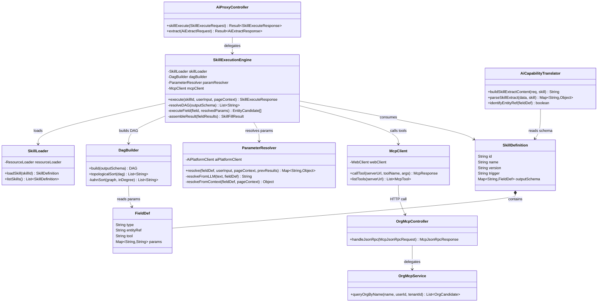
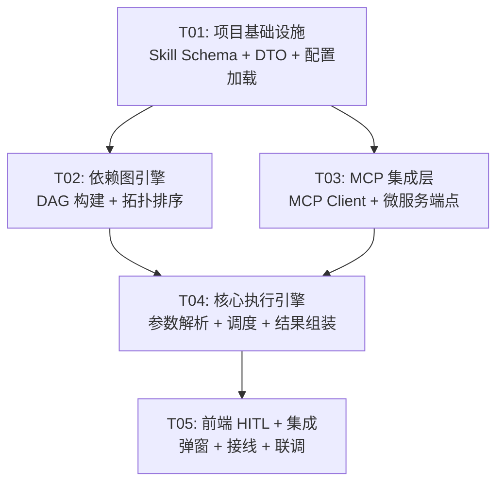

# AI 表单智能填充引擎 — 系统架构设计 + 任务分解

> 版本: P0
> 日期: 2026-07-29
> 作者: Bob (Architect)

---

## 1. 实现方案 + 框架选型

### 1.1 Open Questions 决策

| # | 问题 | 决策 | 理由 |
|---|------|------|------|
| Q1 | BFF 直连 MCP vs 走 ai-platform | **BFF 直连 MCP Server** | ai-platform mis-extract agent 不支持 tool calling，引入 tool calling 不在 P0 范围；BFF 直连延迟低、边界清晰、可复用现有 WebClient 模式 |
| Q2 | 用户映射学习存哪里 | **P0 localStorage**，P1 迁后端 | MVP 快速验证，避免后端表结构变更拖慢 P0 交付 |
| Q3 | Skill 配置文件放哪 | **BFF classpath** `resources/skills/` | Skill 是代码级配置，版本随 BFF 发布，非运行时热更新 |
| Q4 | HITL 是否支持多选 | **MVP 仅单选** | 降低前端弹窗复杂度，单选满足 95% 场景 |

### 1.2 核心技术选型

| 层次 | 选型 | 理由 |
|------|------|------|
| MCP 客户端 SDK | `io.modelcontextprotocol:sdk-java` (官方 Java MCP SDK) | 标准化 JSON-RPC 2.0 over HTTP，类型安全，支持 Tool Calling |
| 依赖图解析 | BFF 自建 `DagBuilder` + Kahn 拓扑排序 | 轻量、无外部依赖、可控错误处理 |
| 并发调度 | `CompletableFuture` + `ExecutorService` | Spring Boot 内置，无独立依赖 |
| 前端 HITL 弹窗 | MUI Dialog + Autocomplete | 与现有 UI 体系一致 |
| Skill JSON 格式 | JSON Schema draft-07 | 已有 Jackson 生态支持 |

### 1.3 架构决策

**Skill 执行引擎位置**: BFF Service 层新建 `SkillExecutionEngine`，职责：
- 加载 classpath `skills/*.json`
- 解析 outputSchema 构建依赖 DAG
- Kahn 拓扑排序确定执行顺序
- 按序调用 MCP 工具（无依赖的字段并发）
- 处理参数三级降级（LLM 抽取 → 上下文/默认 → HITL）
- 组装结果返回前端

**调用链路**: 前端 → Gateway → BFF `AiProxyController.skillExecute` → `SkillExecutionEngine` → MCP Client → 微服务 MCP Server

---

## 2. 文件列表

### 2.1 BFF 新增文件 (`backend/mis-admin-bff/src/main/java/com/mis/adminbff/`)

```
service/
  skill/
    SkillExecutionEngine.java          # 核心执行引擎（拓扑排序 + 调度 + 结果组装）
    SkillLoader.java                   # classpath 技能配置加载器
    DagBuilder.java                    # 依赖图构建 + Kahn 拓扑排序
    ParameterResolver.java             # 参数三级降级解析器
  McpClient.java                       # MCP JSON-RPC 2.0 HTTP 客户端（通用）
  McpToolRegistry.java                 # MCP 工具注册表（白名单管理）
dto/ai/
  SkillExecuteRequest.java             # 前端请求 DTO
  SkillExecuteResponse.java            # 执行结果 DTO
  EntityCandidate.java                 # 实体候选 DTO
  HitlPayload.java                     # HITL 交互数据结构
  SkillDefinition.java                 # Skill JSON 反序列化模型
resource/
  McpProperties.java                   # MCP Server 连接配置
config/
  McpConfig.java                       # MCP Bean 配置
resources/
  skills/
    user-fill.json                     # 示例 Skill 配置
```

### 2.2 BFF 修改文件

```
controller/AiProxyController.java      # 新增 POST /api/v1/ai/skill/execute 端点
service/AiCapabilityTranslator.java    # 扩展 entityRef 字段识别
```

### 2.3 微服务修改文件 (`backend/mis-org-service/src/main/java/com/mis/org/`)

```
controller/
  OrgMcpController.java                # MCP 工具端点暴露
service/
  OrgMcpService.java                   # queryOrgByName 实现
dto/
  McpJsonRpcRequest.java               # MCP JSON-RPC 请求
  McpJsonRpcResponse.java              # MCP JSON-RPC 响应
  OrgCandidate.java                    # 组织候选 DTO
```

### 2.4 前端新增文件 (`frontend/mis-admin-web/src/features/ai/`)

```
components/
  HitlDialog.tsx                       # HITL 多选一弹窗
  EntitySelector.tsx                   # 实体选择器（MVP 单选）
  SkillFillButton.tsx                  # AI 智能填充触发按钮
hooks/
  useSkillFill.ts                      # Skill 填充 Hook
  useEntityMapping.ts                  # 用户映射学习 Hook（localStorage）
types/
  skill-fill.types.ts                  # Skill 填充相关 TS 类型
services/
  skill-api.ts                         # BFF Skill 执行 API 调用
```

### 2.5 前端修改文件

```
features/ai/ai-feature-registry.ts     # 新增 skill-fill feature
features/ai/types.ts                   # 新增 SkillFill/HITL 类型
features/ai/components/ai-form-fill.tsx # 集成 SkillFillButton + HITL 弹窗
```

---

## 3. 数据结构和接口

### 3.1 Skill JSON 配置格式

```json
{
  "id": "user-fill",
  "name": "人员调动填充",
  "version": "1.0",
  "trigger": "把 {person} 调到 {dept}",
  "outputSchema": {
    "personId": {
      "type": "integer",
      "entityRef": "employee",
      "tool": "queryEmployeeByName",
      "params": { "name": "${personName}" }
    },
    "deptId": {
      "type": "integer",
      "entityRef": "dept",
      "tool": "queryDeptByName",
      "params": {
        "name": "${deptName}",
        "orgId": "${orgId}"
      }
    },
    "orgId": {
      "type": "integer",
      "entityRef": "org",
      "tool": "queryOrgByName",
      "params": { "name": "${orgName}" }
    }
  }
}
```

- `${xxx}` 表示依赖另一个字段的解析结果
- 无 `${}` 的参数来自 LLM 抽取或上下文

### 3.2 MCP Tool 签名

#### `queryOrgByName`

```json
{
  "name": "queryOrgByName",
  "description": "按组织名称模糊查询组织实体，返回候选列表（含权限过滤）",
  "inputSchema": {
    "type": "object",
    "properties": {
      "name": { "type": "string", "description": "组织名称或别名" },
      "userId": { "type": "string", "description": "当前用户ID（自动注入）" },
      "tenantId": { "type": "string", "description": "租户ID（自动注入）" }
    },
    "required": ["name"]
  }
}
```

#### 出参

```json
{
  "content": [
    {
      "type": "resource",
      "resource": {
        "uri": "org://candidates",
        "text": "[{\"id\":1,\"name\":\"总部技术部\",\"aliases\":[\"技术部\",\"技术中心\"],\"context\":\"总部 · 一级部门\"}]"
      }
    }
  ]
}
```

### 3.3 HITL 数据结构

```typescript
interface HitlPayload {
  type: 'hitl_required';
  field: string;         // 需要确认的字段名，如 "deptId"
  originalValue: string; // 用户原始输入，如 "技术部"
  candidates: Array<{
    id: number | string;
    name: string;
    aliases: string[];
    context: string;     // 显示用上下文，如 "总部 · 一级部门"
  }>;
}

interface SkillFillResult {
  status: 'success' | 'hitl_required' | 'manual_required' | 'error';
  fields: Record<string, unknown>;
  hitl?: HitlPayload;
  message?: string;      // 错误/提示信息
}
```

### 3.4 类图



---

## 4. 程序调用流程（时序图）

```mermaid
sequenceDiagram
    participant U as 用户
    participant FE as 前端
    participant GW as Gateway
    participant BFF as AiProxyController
    participant ENG as SkillExecutionEngine
    participant DAG as DagBuilder
    class=ParamResolver
    participant RES as ParameterResolver
    participant LLM as AiPlatform/AiCapabilityTranslator
    class=McpClient
    participant MCP as McpClient
    participant MS as 微服务MCP Server

    U->>FE: "把张三调到财务部"
    FE->>FE: 解析自然语言 → 提取 skillId + userInput
    FE->>GW: POST /api/v1/ai/skill/execute
    GW->>BFF: 转发请求
    BFF->>BFF: 校验权限 + 提取 userId/tenantId

    BFF->>ENG: execute(skillId, userInput, pageContext)
    ENG->>ENG: SkillLoader.loadSkill(skillId)
    ENG->>DAG: build(outputSchema) → 构建依赖图
    DAG->>DAG: topologicalSort() → [orgId, deptId, personId]
    DAG-->>ENG: 返回执行顺序

    loop 按拓扑序遍历每个字段
        ENG->>RES: resolve(fieldDef, userInput, pageContext, prevResults)
        
        alt ① LLM 抽取（参数含 ${} 依赖或需要语义理解）
            RES->>LLM: 调用 extract 端点，携带 Skill JSON Schema
            LLM-->>RES: 返回抽取结果
        else ② 上下文/默认值
            RES-->>RES: 从 pageContext 或默认值填充
        else ③ HITL 兜底（无法解析时）
            RES-->>ENG: 标记 needHITL
        end

        RES-->>ENG: resolvedParams

        ENG->>MCP: callTool(toolName, resolvedParams, userId, tenantId)
        MCP->>MS: JSON-RPC 2.0 POST /mcp/tools/call
        MS->>MS: 执行 SQL（JOIN user_org 权限过滤）
        MS-->>MCP: 返回 candidates 数组
        
        alt candidates 数量 == 1
            MCP-->>ENG: 直接使用该候选
        else candidates 数量 > 1
            ENG-->>BFF: 中断，返回 hitl_required
            BFF-->>FE: SkillFillResult(status=hitl_required, hitlPayload)
            FE->>U: 弹窗展示候选列表
            U->>FE: 用户选择
            FE->>ENG: 回填用户选择（resume execution）
            ENG->>ENG: 继续执行后续字段
        else candidates 数量 == 0
            ENG-->>BFF: 返回 manual_required
            BFF-->>FE: 提示用户手动填写
        end
    end

    ENG->>ENG: assembleResult(all field results)
    ENG-->>BFF: SkillFillResult(status=success, fields)
    BFF-->>GW: Result~SkillFillResponse~
    GW-->>FE: 返回填充结果
    FE->>FE: 回填表单字段 + 记录映射学习（localStorage）
```

---

## 5. 任务列表

| 任务ID | 任务名称 | 涉及文件 | 前置依赖 | 优先级 | 预估复杂度 |
|--------|----------|----------|----------|--------|------------|
| T01 | **项目基础设施**：Skill JSON Schema 定义 + 配置加载 + DTO 层 | `SkillDefinition.java`, `FieldDef.java`, `SkillLoader.java`, `SkillExecuteRequest.java`, `SkillExecuteResponse.java`, `EntityCandidate.java`, `HitlPayload.java`, `SkillFillResult.java`, `user-fill.json` | 无 | P0 | 中 |
| T02 | **依赖图引擎**：DAG 构建 + 拓扑排序 | `DagBuilder.java`, `McpProperties.java`, `McpConfig.java` | T01 | P0 | 中 |
| T03 | **MCP 集成层**：MCP Client + 微服务 MCP 端点 | `McpClient.java`, `McpToolRegistry.java`, `OrgMcpController.java`, `OrgMcpService.java`, `OrgCandidate.java`, `McpJsonRpcRequest.java`, `McpJsonRpcResponse.java` | T01 | P0 | 高 |
| T04 | **核心执行引擎**：参数解析 + 调度 + 结果组装 | `SkillExecutionEngine.java`, `ParameterResolver.java`, `AiCapabilityTranslator.java`(扩展), `AiProxyController.java`(新增端点) | T01, T02, T03 | P0 | 高 |
| T05 | **前端 HITL + 集成**：弹窗组件 + 接线 + 端到端联调 | `HitlDialog.tsx`, `EntitySelector.tsx`, `SkillFillButton.tsx`, `useSkillFill.ts`, `useEntityMapping.ts`, `skill-fill.types.ts`, `skill-api.ts`, `ai-feature-registry.ts`(修改), `types.ts`(修改), `ai-form-fill.tsx`(修改) | T04 | P0 | 中 |

> **说明**：严格按规则 ≤5 任务。T01 包含所有配置/DTO 基础设施，T02-03 并行可独立推进，T04 依赖前三个任务完成，T05 为前端全量实现。

---

## 6. 依赖包列表

### BFF (Maven)

```xml
<dependency>
    <groupId>io.modelcontextprotocol</groupId>
    <artifactId>sdk-java</artifactId>
    <version>0.3.0</version>
</dependency>
<!-- Spring WebFlux WebClient (已有) -->
<!-- Jackson (已有) -->
```

### 前端 (npm)

```
# 已有依赖，无需新增
@mui/material@^5.x        # Dialog, Autocomplete
react@^18.x               # UI 框架
```

---

## 7. 共享知识（跨文件约定）

### 7.1 API 响应格式
所有 BFF 端点统一使用 `Result<T>` 包装：
```json
{ "code": 200, "data": {...}, "message": "success" }
```

### 7.2 Skill 执行端点
- `POST /api/v1/ai/skill/execute`
- 请求头：`Authorization`, `X-Trace-Id`（透传）
- 权限：`ai:skill:execute`

### 7.3 参数解析优先级
1. `${xxx}` 依赖 → 从 prevResults 获取
2. LLM 抽取 → 调用 `AiCapabilityTranslator.buildSkillExtractContent()`
3. 上下文/默认值 → 从 `pageContext` 或 Skill 配置 default 获取
4. 无法解析 → 标记 HITL 或 manual_required

### 7.4 HITL 交互协议
- 单轮对话：BFF 返回 `hitl_required` → 前端弹窗 → 用户选择 → 前端调用 resume 端点 → BFF 继续执行
- MVP 仅支持单选
- 映射学习存 `localStorage` 键 `ai-entity-mapping-{userId}-{field}`

### 7.5 MCP 调用规范
- JSON-RPC 2.0 over HTTP POST
- `userId` / `tenantId` 由 BFF 自动注入（SecurityContext）
- MCP 工具白名单在 `McpToolRegistry` 配置

### 7.6 日期/ID 格式
- 所有 ID 使用 `Long` 类型
- 时间字段使用 ISO 8601 UTC

---

## 8. 待明确事项

| # | 事项 | 影响范围 | 当前假设 |
|---|------|----------|----------|
| 1 | `io.modelcontextprotocol:sdk-java` 具体版本号及 Maven 中央库可用性 | T03 | 假设 0.3.0 可用，否则 fallback 到自实现 JSON-RPC 2.0 Client |
| 2 | 微服务 MCP Server 部署路径（独立进程 vs 嵌入现有 Spring Boot） | T03 | 假设嵌入 mis-org-service 新增 Controller |
| 3 | `queryDeptByName` / `queryEmployeeByName` 是否 P0 同步实现 | T03, T04 | P0 仅实现 `queryOrgByName`，其他 tool 仅定义接口 |
| 4 | HITL resume 端点是复用 `/skill/execute` 还是新增 `/skill/resume` | T04, T05 | 假设复用同一端点，通过 `resumeToken` 区分 |
| 5 | 权限拦截具体注解形式（`@PreAuthorize` vs 自定义） | T04 | 沿用 BFF 现有 `ApiPermissionInterceptor` |

---

## 9. 任务依赖图



---

## 10. IS_PASS 自检清单

| 产出物 | 状态 |
|--------|------|
| ✅ 实现方案 + 框架选型 | 已完成（含 Q1-Q4 决策） |
| ✅ 文件列表及相对路径 | 已完成（BFF 新增/修改 + 前端新增/修改 + 微服务修改） |
| ✅ 数据结构和接口定义 | 已完成（类图 + Skill JSON 格式 + MCP 签名 + HITL 协议） |
| ✅ 程序调用流程（时序图） | 已完成（含依赖图解析→拓扑排序→MCP调用→HITL→回填全链路） |
| ✅ 任务列表（有序+依赖） | 已完成（5 个任务，含文件/依赖/优先级） |
| ✅ 依赖包列表 | 已完成（BFF Maven + 前端 npm） |
| ✅ 共享知识 | 已完成（7 条跨文件约定） |
| ✅ 待明确事项 | 已完成（5 项待确认） |
| ✅ 任务依赖图 | 已完成（Mermaid 图） |

**结论：全部产出物齐全，无遗漏。**
