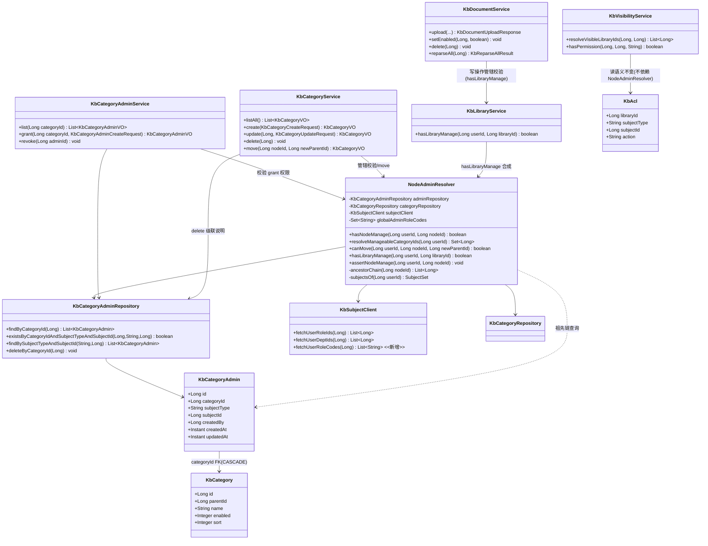
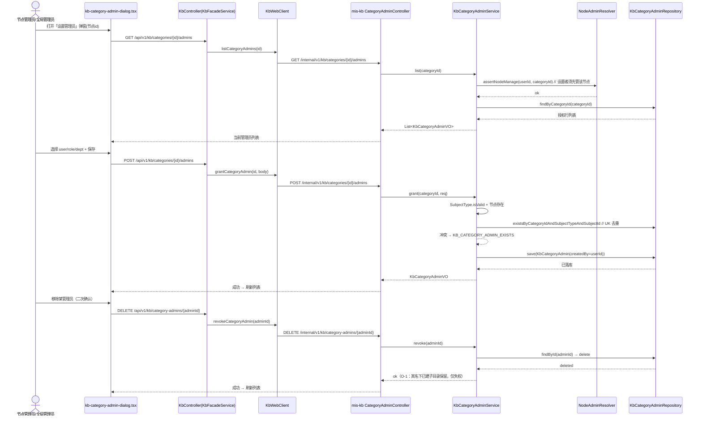
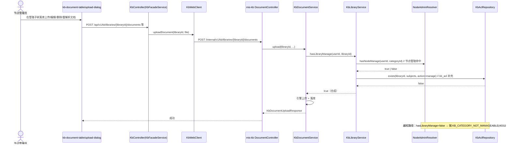
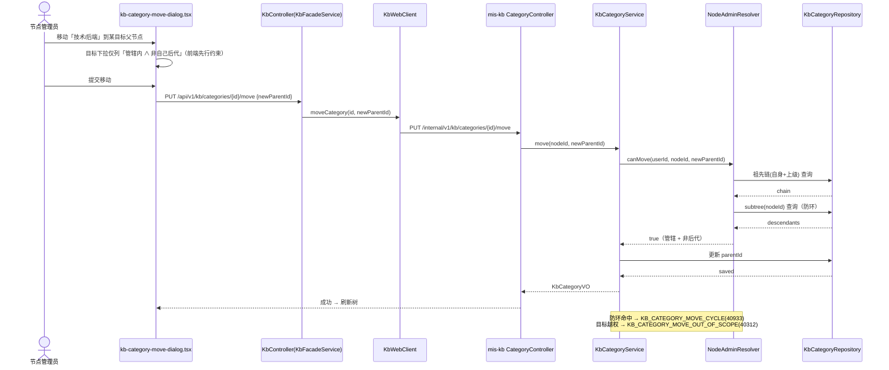
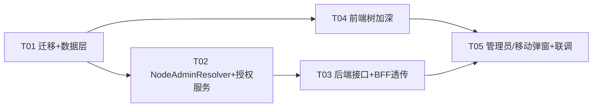

# 系统设计：知识库域一期（多级分类树 + 任意层级管理员 + 子树权限）

> 状态：架构设计（第二阶段产出）| 架构师：高见远（software-architect）| 日期：2026-08-10
> 依据：收敛 PRD `deliverables/software-company/doc-kb-separation-prd-kb-phase1-2026-08-10.md`（决策 Q3/Q4/Q5/Q8/Q9/Q6 已拍板，本设计直接采用，不重新决策）
> 代码基线：已读 `KbCategory`/`KbCategoryService`/`CategoryController`/`KbCategoryRepository`、`KbAcl`/`KbAclService`/`KbVisibilityService`/`KbSubjectClient`、`KbLibraryService`、`KbDocumentService`/`DocumentController`、`KbResultCode`/`SubjectType`、BFF `KbController`/`KbFacadeService`/`KbWebClient`/`AbstractDownstreamClient`、前端 `kb-category-page.tsx`/`kb-api.ts`/`types.ts`/`kb-subject-selector.tsx`、迁移 `V13/V14/V17/V23`
> 配套图表：`docs/class-diagram.mermaid`、`docs/kb-category-admin-sequence.mermaid`（管理员设置）、`docs/kb-document-manage-sequence.mermaid`（文档管辖判定）、`docs/kb-move-node-sequence.mermaid`（移动防环）

---

## 目录

1. [实现方案与框架选型](#1-实现方案与框架选型)
2. [文件列表](#2-文件列表)
3. [数据结构与接口（类图）](#3-数据结构与接口)
4. [REST 端点设计](#4-rest-端点设计)
5. [程序调用流程（时序图）](#5-程序调用流程)
6. [任务列表](#6-任务列表)
7. [依赖包列表](#7-依赖包列表)
8. [共享知识](#8-共享知识)
9. [待明确事项](#9-待明确事项)

---

## 1. 实现方案与框架选型

### 1.1 核心难点

| # | 难点 | 收敛 PRD 对应 | 应对 |
|---|---|---|---|
| D1 | 前端分类树从「两级」加深为「任意层级」，含展开/折叠、完整节点操作菜单、父级下拉完整树 | R-KB-P0-1 | **后端无需新增树接口**（`KbCategoryService.listAll()` 已一次返回全量、`parentId` 无层级限制）；仅前端 `flattenCategories` 递归化 + 组件 state 展开/折叠 |
| D2 | 任意层级管理员授权表 + 增删查 | R-KB-P0-2 | 新建 `kb_category_admin`（Flyway V24）+ `KbCategoryAdminService`，主体复用 `SubjectType`(user/role/dept) |
| D3 | 节点管辖判定链（全局短路 + 祖先链 + 子树并集），必须可单测 | R-KB-P0-3 | 独立 `NodeAdminResolver` 纯服务（不依赖 Web 层），注入 repository + `KbSubjectClient` |
| D4 | 移动节点防环 + 目标在管辖内；删除校验扩展 | R-KB-P0-4 | `NodeAdminResolver.canMove`（管辖 + 非后代）；删除沿用 `KB_CATEGORY_HAS_CHILDREN` + FK 级联清授权 |
| D5 | 节点管理员自动获得节点下所有库 manage（Q9），与 kb_acl 共存 | R-KB-P0-5 | `hasLibraryManage = hasNodeManage(categoryId) ∨ kb_acl.exists(manage)` 合成；`KbVisibilityService` 读语义不变 |

### 1.2 框架选型

**零新增第三方依赖**。全部复用既有技术栈：

| 层 | 技术 | 说明 |
|---|---|---|
| 数据迁移 | PostgreSQL + Flyway（mis-migrator） | 新迁移 `V24__kb_category_admin.sql`，幂等风格对齐 `V23` |
| 后端 | Java 17 + Spring Boot（mis-kb） | 既有分层 Controller/Service/Repository/Entity；新增 `NodeAdminResolver` 独立服务 |
| 跨服务主体取数 | `KbSubjectClient`（mis-kb 已有） | 新增 `fetchUserRoleCodes` 方法（复用内部 `fetchUser` 已有 `roles[].code`） |
| BFF | mis-admin-bff 透传模式 | `KbWebClient` → `KbFacadeService` → `KbController` 三层透传，纯透传不加工 |
| 前端 | React + TS + Tailwind + shadcn/ui（features/kb） | 就地改造 `kb-category-page.tsx`；复用 `KbSubjectSelector`（user/role/dept 三选）+ `PermissionGate` |

### 1.3 架构模式与关键决策

- **MVC/分层不变**：不引入新架构。`NodeAdminResolver` 是领域服务（Service 层），只依赖 repository 与 `KbSubjectClient`，不依赖 Web/Controller，保证可单测。
- **管辖判定统一收口**：所有「能否管理某节点/库」的判定只允许走 `NodeAdminResolver`（或经其合成的 `hasLibraryManage`），**禁止在 Service/Controller 内联祖先链逻辑**（同 `DocumentChunkConfigResolver` 铁律先例）。
- **读/管语义分离**：普通用户读库仍走 `KbVisibilityService`（public ∪ ACL read）不被节点授权污染；节点授权只合成管理语义。
- **BFF 兜底判权**：新增管理类端点（设置管理员/移动/管辖查询）除 `ApiPermissionInterceptor` 主路径外，仿照 `requireHitTestPermission()` 加 `requireCategoryManagePermission()` 兜底（读 `UserPermissionLoader.load`），双闸门。
- **权限码**：新增 `kb:category:manage`（域级管理码，V24 按钮节点 + 授权 TENANT_ADMIN + sys_menu_api 登记），用于「设置管理员/移动」功能门控；与页面码 `kb:category:list` 不共用（遵守 `uk_menu_app_permission` 唯一约束，V17 教训）。
- **前端改造方式**：features/kb 就地改造（Q6），不并行新域；树组件拆独立文件以利维护与测试，但页面整体仍是左树右表 + 弹窗的既有交互。

### 1.4 改动面一览

| 模块 | 新增 | 修改 |
|---|---|---|
| mis-migrator | V24 迁移 | — |
| mis-kb | `KbCategoryAdmin` 实体/Repo/DTO/Service/Controller、`NodeAdminResolver`、`NodeAdminGuard`（可并入 Resolver）、`KbCategoryMoveRequest` | `KbSubjectClient`（+fetchUserRoleCodes）、`KbCategoryService`（管辖校验 + move）、`KbLibraryService`（+hasLibraryManage）、`KbDocumentService`（写操作管辖校验）、`KbResultCode`（+3 业务码）、`CategoryController`（+manageable-ids/+move）、`AclController`（可选：文档侧共用 hasLibraryManage） |
| mis-admin-bff | DTO `KbCategoryAdminVO`、`KbCategoryAdminCreateRequest`、`KbManageableCategoryIdsVO`（可选，或直接 List<Long>） | `KbWebClient`、`KbFacadeService`、`KbController`（+4 端点 + 兜底判权） |
| frontend features/kb | `kb-category-tree.tsx`、`kb-category-admin-dialog.tsx`、`kb-category-move-dialog.tsx`、`kb-manageable-context.ts`（可选） | `kb-category-page.tsx`（递归树 + 展开/折叠 + 节点操作菜单 + 管辖高亮 + 只看管辖）、`kb-api.ts`、`types.ts`、`stores/use-kb-store.ts`（+categoryEpoch 失效通知，可选） |

---

## 2. 文件列表

> A = 新增，M = 修改。相对仓库根 `D:\code\mis-platform`。

### 2.1 数据库迁移（mis-migrator）

| 文件 | 类型 | 说明 |
|---|---|---|
| `backend/mis-migrator/src/main/resources/db/migration/V24__kb_category_admin.sql` | A | 建 `kb_category_admin` + 索引 + 注释 + `kb:category:manage` 按钮权限码与授权 + sys_api/sys_menu_api 登记 |

### 2.2 mis-kb 后端

| 文件 | 类型 | 说明 |
|---|---|---|
| `backend/mis-kb/src/main/java/com/mis/kb/domain/entity/KbCategoryAdmin.java` | A | 授权实体（category_id/subject_type/subject_id/created_by/created_at/updated_at） |
| `backend/mis-kb/src/main/java/com/mis/kb/domain/repository/KbCategoryAdminRepository.java` | A | 按主体查 / 按节点查 / 去重 exists / deleteByCategoryId |
| `backend/mis-kb/src/main/java/com/mis/kb/domain/service/NodeAdminResolver.java` | A | 管辖判定核心（全局短路 + 祖先链 + 子树并集 + canMove + hasLibraryManage） |
| `backend/mis-kb/src/main/java/com/mis/kb/domain/service/KbCategoryAdminService.java` | A | 管理员授权 CRUD（list/grant/revoke） |
| `backend/mis-kb/src/main/java/com/mis/kb/api/dto/KbCategoryAdminCreateRequest.java` | A | 授权入参（subjectType/subjectId） |
| `backend/mis-kb/src/main/java/com/mis/kb/api/dto/KbCategoryAdminVO.java` | A | 授权视图（含 categoryId/subjectType/subjectId/createdBy/createdAt/updatedAt） |
| `backend/mis-kb/src/main/java/com/mis/kb/api/dto/KbCategoryMoveRequest.java` | A | 移动入参（newParentId） |
| `backend/mis-kb/src/main/java/com/mis/kb/api/controller/CategoryAdminController.java` | A | 授权端点（list/grant/revoke） |
| `backend/mis-kb/src/main/java/com/mis/kb/api/client/KbSubjectClient.java` | M | +`fetchUserRoleCodes(Long userId)`（复用内部 fetchUser） |
| `backend/mis-kb/src/main/java/com/mis/kb/domain/service/KbCategoryService.java` | M | create/update/delete 加管辖校验；+`move(id, newParentId)`；delete 保持 KB_CATEGORY_HAS_CHILDREN + FK 级联说明 |
| `backend/mis-kb/src/main/java/com/mis/kb/domain/service/KbLibraryService.java` | M | +`hasLibraryManage(userId, libraryId)`（合成 Q9） |
| `backend/mis-kb/src/main/java/com/mis/kb/domain/service/KbDocumentService.java` | M | 写操作（upload/setEnabled/reparse/delete/reparseAll）加管辖校验（经 hasLibraryManage） |
| `backend/mis-kb/src/main/java/com/mis/kb/domain/model/KbResultCode.java` | M | +`KB_CATEGORY_ADMIN_EXISTS(40932)`、`KB_CATEGORY_NOT_MANAGEABLE(40311)`、`KB_CATEGORY_MOVE_CYCLE(40933)`、`KB_CATEGORY_MOVE_OUT_OF_SCOPE(40312)` |
| `backend/mis-kb/src/main/java/com/mis/kb/api/controller/CategoryController.java` | M | +`GET /manageable-ids`、`PUT /{id}/move` |
| `backend/mis-kb/src/main/java/com/mis/kb/api/controller/AclController.java` | M | （如文档侧校验放 Controller 层则无需改；建议校验下沉 Service，本文件不动） |

**测试文件（mis-kb）**

| 文件 | 类型 | 说明 |
|---|---|---|
| `backend/mis-kb/src/test/java/com/mis/kb/domain/service/NodeAdminResolverTest.java` | A | 全局短路/直接授权/祖先继承/角色/部门/无授权拒绝/移动范围/防环/合成 manage（对齐 PRD 验收 3） |
| `backend/mis-kb/src/test/java/com/mis/kb/domain/service/KbCategoryAdminServiceTest.java` | A | grant 去重/非法主体/revoke/级联删除 |
| `backend/mis-kb/src/test/java/com/mis/kb/api/controller/CategoryAdminControllerTest.java` | A | 端点层冒烟（可选，若习惯 ControllerTest 则加） |
| `backend/mis-kb/src/test/java/com/mis/kb/domain/service/KbCategoryServiceManageTest.java` | A | 管辖校验接入后 create/update/delete/move 行为 |

### 2.3 mis-admin-bff 后端

| 文件 | 类型 | 说明 |
|---|---|---|
| `backend/mis-admin-bff/src/main/java/com/mis/adminbff/dto/kb/KbCategoryAdminVO.java` | A | BFF 镜像 |
| `backend/mis-admin-bff/src/main/java/com/mis/adminbff/dto/kb/KbCategoryAdminCreateRequest.java` | A | BFF 镜像 |
| `backend/mis-admin-bff/src/main/java/com/mis/adminbff/client/KbWebClient.java` | M | +listCategoryAdmins/grantCategoryAdmin/revokeCategoryAdmin/listManageableCategoryIds/moveCategory（沿用 `loginContextHeaders()` 透传） |
| `backend/mis-admin-bff/src/main/java/com/mis/adminbff/service/KbFacadeService.java` | M | 透传 5 个方法 |
| `backend/mis-admin-bff/src/main/java/com/mis/adminbff/controller/KbController.java` | M | +4 端点（admins 列表/新增/删除、categories/{id}/move、categories/manageable-ids）+ `requireCategoryManagePermission()` 兜底 |

**测试文件（BFF）**

| 文件 | 类型 | 说明 |
|---|---|---|
| `backend/mis-admin-bff/src/test/java/com/mis/adminbff/controller/KbControllerCategoryAdminPermissionTest.java` | A | 新增端点兜底判权（无权限码 403）与透传冒烟（仿 KbControllerHitTestPermissionTest） |

### 2.4 前端 features/kb

| 文件 | 类型 | 说明 |
|---|---|---|
| `frontend/mis-admin-web/src/features/kb/types.ts` | M | +`KbCategoryAdmin`、`KbCategoryAdminCreatePayload`、`KbCategoryManageableInfo`（可选） |
| `frontend/mis-admin-web/src/features/kb/api/kb-api.ts` | M | +listCategoryAdmins/grantCategoryAdmin/revokeCategoryAdmin/listManageableCategoryIds/moveCategory |
| `frontend/mis-admin-web/src/features/kb/category/kb-category-tree.tsx` | A | 任意层级递归树组件（展开/折叠、缩进、节点操作菜单、管辖高亮、只看管辖开关） |
| `frontend/mis-admin-web/src/features/kb/category/kb-category-admin-dialog.tsx` | A | 管理员设置弹窗（当前列表 + 添加 user/role/dept + 移除确认 + 范围说明） |
| `frontend/mis-admin-web/src/features/kb/category/kb-category-move-dialog.tsx` | A | 移动弹窗（目标下拉仅列管辖内且非后代） |
| `frontend/mis-admin-web/src/features/kb/category/kb-category-page.tsx` | M | 用 `KbCategoryTree` 替换两级表格；父级下拉改完整树；接入管辖高亮数据与操作弹窗 |
| `frontend/mis-admin-web/src/features/kb/stores/use-kb-store.ts` | M | +`categoryEpoch`（可选，用于 KeepAlive 下树/权限页联动失效） |

---

## 3. 数据结构与接口

### 3.1 V24 迁移 DDL（要点）

```sql
-- ===========================================================================
-- V24__kb_category_admin.sql —— 任意层级节点管理员授权表（kb_category_tree_admin）
-- ===========================================================================
CREATE TABLE IF NOT EXISTS kb_category_admin (
    id           BIGINT PRIMARY KEY,
    category_id  BIGINT      NOT NULL,
    subject_type VARCHAR(20) NOT NULL,   -- user | role | dept（复用 SubjectType）
    subject_id   BIGINT      NOT NULL,
    created_by   BIGINT      NULL,       -- O-2 采纳：创建人（审计/追溯），null 允许
    created_at   TIMESTAMP   NOT NULL,
    updated_at   TIMESTAMP   NOT NULL,
    CONSTRAINT uk_kb_category_admin UNIQUE (category_id, subject_type, subject_id),
    CONSTRAINT fk_kb_category_admin_category FOREIGN KEY (category_id)
        REFERENCES kb_category(id) ON DELETE CASCADE   -- 删节点级联清授权行
);
CREATE INDEX IF NOT EXISTS idx_kb_category_admin_subject ON kb_category_admin (subject_type, subject_id);
CREATE INDEX IF NOT EXISTS idx_kb_category_admin_category ON kb_category_admin (category_id);
COMMENT ON TABLE  kb_category_admin IS '分类节点管理员（管理范围=以该节点为根的子树）';
COMMENT ON COLUMN kb_category_admin.subject_type IS '主体类型 user/role/dept（复用 mis-iam/mis-org 主体 id）';
COMMENT ON COLUMN kb_category_admin.created_by   IS '授权创建人用户 id（O-2）';

-- 权限码：kb:category:manage（域级管理码，设置管理员/移动功能门控）
-- 固定 ID 段 9106x（V17 已用 91060-91069 的 sys_api，菜单按钮 9105x 段：91051 已被 kb_qa_feedback 使用 → 从 91052 起）
INSERT INTO sys_menu (id, tenant_id, app_id, parent_id, code, name, type, path, component, permission, icon, sort, visible, status, created_at, updated_at)
SELECT v.* FROM (VALUES
    (91052, 1, 91010, 91032, 'kb_category_manage', '设置分类管理员', 3, NULL, NULL, 'kb:category:manage', NULL, 4, 1, 1, NOW(), NOW())
) AS v(id, tenant_id, app_id, parent_id, code, name, type, path, component, permission, icon, sort, visible, status, created_at, updated_at)
WHERE NOT EXISTS (SELECT 1 FROM sys_menu WHERE id = v.id);

-- 授权给内置租户管理员 role_id=1（口径与 V14 一致）
INSERT INTO sys_role_permission (id, role_id, perm_type, target_id, created_at)
SELECT 91052, 1, 'menu'::sys_perm_type, 91052, NOW()
WHERE NOT EXISTS (SELECT 1 FROM sys_role_permission WHERE role_id=1 AND perm_type='menu' AND target_id=91052);

-- sys_api / sys_menu_api 登记（让 ApiPermissionInterceptor 真正拦得住，仿 V17 D 段）
INSERT INTO sys_api (id, module_id, parent_id, code, type, name, http_method, path_pattern, sort, status, created_at, updated_at)
SELECT v.* FROM (VALUES
    (91070, 91020, 91060, '0091', 'endpoint'::sys_api_node_type, '分类管理员列表', 'GET',    '/api/v1/kb/categories/{id}/admins', 91, 1, NOW(), NOW()),
    (91071, 91020, 91060, '0092', 'endpoint'::sys_api_node_type, '新增分类管理员', 'POST',   '/api/v1/kb/categories/{id}/admins', 92, 1, NOW(), NOW()),
    (91072, 91020, 91060, '0093', 'endpoint'::sys_api_node_type, '移除分类管理员', 'DELETE', '/api/v1/kb/category-admins/{adminId}', 93, 1, NOW(), NOW()),
    (91073, 91020, 91060, '0094', 'endpoint'::sys_api_node_type, '移动分类节点',   'PUT',    '/api/v1/kb/categories/{id}/move',    94, 1, NOW(), NOW()),
    (91074, 91020, 91060, '0095', 'endpoint'::sys_api_node_type, '管辖分类ID',     'GET',    '/api/v1/kb/categories/manageable-ids', 95, 1, NOW(), NOW())
) AS v(id, module_id, parent_id, code, type, name, http_method, path_pattern, sort, status, created_at, updated_at)
WHERE NOT EXISTS (SELECT 1 FROM sys_api WHERE id = v.id);

INSERT INTO sys_menu_api (id, menu_id, api_id, created_at)
SELECT v.* FROM (VALUES
    (91080, 91052, 91070, NOW()), (91081, 91052, 91071, NOW()), (91082, 91052, 91072, NOW()),
    (91083, 91052, 91073, NOW()), (91084, 91052, 91074, NOW())
) AS v(id, menu_id, api_id, created_at)
WHERE NOT EXISTS (SELECT 1 FROM sys_menu_api WHERE menu_id = v.menu_id AND api_id = v.api_id);
```

> ⚠️ 迁移实现时需读 V17 全文核对 `sys_api`/`sys_menu_api` 列清单（V8 已 DROP tenant_id/app_id 列），并以 `WHERE NOT EXISTS` 保证幂等；ID 段以实际占用核对为准（91052 按钮、91070-91074 api、91080-91084 menu_api），避免与 V17 冲突。

### 3.2 实体与枚举

**KbCategoryAdmin**（新增实体）：

| 字段 | 类型 | 约束 | 说明 |
|---|---|---|---|
| id | Long | PK | IdGenerator.nextId() |
| categoryId | Long | NOT NULL, FK→kb_category ON DELETE CASCADE | 任意层级节点 |
| subjectType | String(20) | NOT NULL, UK 之一 | user/role/dept |
| subjectId | Long | NOT NULL, UK 之一 | mis-iam/mis-org 主体 id |
| createdBy | Long | NULL | O-2 采纳 |
| createdAt / updatedAt | Instant | NOT NULL | 审计时间 |

**复用现有枚举**：`SubjectType`（USER/ROLE/DEPT，不改）。
**新增业务码**（KbResultCode，段位避开既有值）：

| 码 | 值 | 说明 |
|---|---|---|
| KB_CATEGORY_ADMIN_EXISTS | 40932 | 同节点同主体重复授权 |
| KB_CATEGORY_NOT_MANAGEABLE | 40311 | 该节点不在您的管理范围内 |
| KB_CATEGORY_MOVE_OUT_OF_SCOPE | 40312 | 目标位置不在您的管理范围内 |
| KB_CATEGORY_MOVE_CYCLE | 40933 | 不能移入自己的后代节点 |

### 3.3 类图（Mermaid classDiagram）



> 完整可渲染版见 `docs/class-diagram.mermaid`。

---

## 4. REST 端点设计

### 4.1 mis-kb 内部端点（/internal/v1/**，BFF 唯一调用方）

| 方法 | 路径 | 入参 | 出参 | 权限/校验 |
|---|---|---|---|---|
| GET | `/internal/v1/kb/categories/manageable-ids` | — | `Result<Set<Long>>` | 取当前用户（SecurityContextHolder）→ `resolveManageableCategoryIds` |
| PUT | `/internal/v1/kb/categories/{id}/move` | body `KbCategoryMoveRequest{newParentId}` | `Result<KbCategoryVO>` | `canMove` 校验（管辖 + 防环） |
| GET | `/internal/v1/kb/categories/{id}/admins` | path id | `Result<List<KbCategoryAdminVO>>` | 节点存在校验（读列表需管理权，由调用方/Controller 前置 `assertNodeManage`） |
| POST | `/internal/v1/kb/categories/{id}/admins` | body `KbCategoryAdminCreateRequest{subjectType,subjectId}` | `Result<KbCategoryAdminVO>` | 节点存在 + subjectType 合法 + UK 去重 + `assertNodeManage`（谁设置管理员谁须先管该节点） |
| DELETE | `/internal/v1/kb/category-admins/{adminId}` | path adminId | `Result<Void>` | 行存在 + `assertNodeManage`（谁回收谁须管该节点） |

> 说明：`manageable-ids` 与文档/目录写操作共用 `SecurityContextHolder`（BFF `loginContextHeaders()` 已透传 X-User-Id 等）。

### 4.2 BFF 聚合端点（/api/v1/kb/**，前端唯一入口）

| 方法 | 路径 | 说明 | 功能权限码 |
|---|---|---|---|
| GET | `/api/v1/kb/categories/manageable-ids` | 透传 mis-kb | 页面码 `kb:category:list`（列表页即需） |
| PUT | `/api/v1/kb/categories/{id}/move` | 透传 | `kb:category:manage`（+兜底 `requireCategoryManagePermission`） |
| GET | `/api/v1/kb/categories/{id}/admins` | 透传 | `kb:category:manage` |
| POST | `/api/v1/kb/categories/{id}/admins` | 透传 | `kb:category:manage` |
| DELETE | `/api/v1/kb/category-admins/{adminId}` | 透传 | `kb:category:manage` |

> 均沿用 `KbWebClient` 三层透传（`loginContextHeaders()` 透传登录上下文）；新增端点按 V24 的 sys_api/sys_menu_api 登记受 `ApiPermissionInterceptor` 拦截。

### 4.3 判定链实现（NodeAdminResolver 伪代码）

```text
subjectsOf(userId) = {userId} ∪ KbSubjectClient.fetchUserRoleIds(userId) ∪ fetchUserDeptIds(userId)
globalAdminRoleCodes = 配置注入，默认 {TENANT_ADMIN}（superadmin 平台用户按现有网关语义已可访问管理端）

hasNodeManage(userId, nodeId):
  1) userId == null → false
  2) roleCodes = KbSubjectClient.fetchUserRoleCodes(userId)
     若 roleCodes ∩ globalAdminRoleCodes ≠ ∅ → true        # 全局管理员短路
  3) for cur in ancestorChain(nodeId):                       # 自身 → parent → … → 根
        若 adminRepository.existsByCategoryIdAndSubjectTypeAndSubjectIdIn(
            cur, subjectsOf(userId)) → true                  # 任一主体命中
  4) false

resolveManageableCategoryIds(userId):
  1) hit = adminRepository.findBySubjectTypeInAndSubjectIdIn(
        [user,role,dept], subjectsOf(userId)) → categoryId 集合
  2) return ∪ subtree(h) for h in hit                        # 自身 + 全部后代

canMove(userId, nodeId, newParentId):
  return hasNodeManage(userId, nodeId)
     and hasNodeManage(userId, newParentId)                  # 目标在管辖内
     and newParentId ∉ subtree(nodeId)                       # 防环

hasLibraryManage(userId, libraryId):
  categoryId = kb_library.categoryId(libraryId)
  return hasNodeManage(userId, categoryId)                   # Q9 节点管理员合成 manage
      or kb_acl.exists(libraryId, subjectsOf(userId), action=manage)
```

---

## 5. 程序调用流程

### 5.1 节点管理员设置（授权 + 回收）



### 5.2 节点管理员管理子树内文档（管辖判定）



### 5.3 移动节点防环校验



---

## 6. 任务列表

> 按实现顺序、依赖驱动。HARD LIMIT：≤5 个任务；每任务 ≥3 文件；T01 为数据/基础设施。

### T01：数据层与迁移（V24 + 实体 + 仓库 + DTO + 客户端扩展）

- **Task ID**：T01
- **Task Name**：V24 迁移 + kb_category_admin 数据层 + KbSubjectClient 扩展 + 业务码
- **Source Files**：
  - A `backend/mis-migrator/src/main/resources/db/migration/V24__kb_category_admin.sql`
  - A `backend/mis-kb/.../domain/entity/KbCategoryAdmin.java`
  - A `backend/mis-kb/.../domain/repository/KbCategoryAdminRepository.java`
  - A `backend/mis-kb/.../api/dto/KbCategoryAdminCreateRequest.java`
  - A `backend/mis-kb/.../api/dto/KbCategoryAdminVO.java`
  - A `backend/mis-kb/.../api/dto/KbCategoryMoveRequest.java`
  - M `backend/mis-kb/.../domain/model/KbResultCode.java`
  - M `backend/mis-kb/.../api/client/KbSubjectClient.java`（+fetchUserRoleCodes）
- **Dependencies**：无
- **Priority**：P0
- **验收**：`kb_category_admin` 落库可迁移；Repository 查询方法齐全；`fetchUserRoleCodes` 单测（复用 IAM 镜像，含降级空列表）；新增业务码编译通过。

### T02：管辖判定核心 NodeAdminResolver + 授权 CRUD 服务（含单测）

- **Task ID**：T02
- **Task Name**：NodeAdminResolver 判定链 + KbCategoryAdminService（纯服务层，可单测）
- **Source Files**：
  - A `backend/mis-kb/.../domain/service/NodeAdminResolver.java`
  - A `backend/mis-kb/.../domain/service/KbCategoryAdminService.java`
  - A `backend/mis-kb/src/test/java/com/mis/kb/domain/service/NodeAdminResolverTest.java`
  - A `backend/mis-kb/src/test/java/com/mis/kb/domain/service/KbCategoryAdminServiceTest.java`
  - M（依赖）`backend/mis-kb/.../domain/repository/KbCategoryRepository.java`（如需要 `findAll` 内存建树/祖先链辅助，按需）
- **Dependencies**：T01
- **Priority**：P0
- **验收**：对齐 PRD 验收 3 的 8 类用例全绿（全局放行/直接授权/祖先继承/角色命中/部门命中/无授权拒绝/移动范围/防环）；`hasLibraryManage` 合成（节点 ∨ kb_acl）覆盖。

### T03：后端接口接入 + 管辖校验落到目录/文档操作 + BFF 透传

- **Task ID**：T03
- **Task Name**：mis-kb 端点（admins/move/manageable-ids）+ KbCategoryService/DocumentService 管辖校验 + BFF 透传与兜底判权
- **Source Files**：
  - A `backend/mis-kb/.../api/controller/CategoryAdminController.java`
  - M `backend/mis-kb/.../api/controller/CategoryController.java`（+manageable-ids/+move）
  - M `backend/mis-kb/.../domain/service/KbCategoryService.java`（管辖校验 + move）
  - M `backend/mis-kb/.../domain/service/KbLibraryService.java`（+hasLibraryManage）
  - M `backend/mis-kb/.../domain/service/KbDocumentService.java`（写操作管辖校验）
  - A `backend/mis-kb/src/test/java/com/mis/kb/domain/service/KbCategoryServiceManageTest.java`
  - A `backend/mis-admin-bff/.../dto/kb/KbCategoryAdminVO.java` + `KbCategoryAdminCreateRequest.java`
  - M `backend/mis-admin-bff/.../client/KbWebClient.java`
  - M `backend/mis-admin-bff/.../service/KbFacadeService.java`
  - M `backend/mis-admin-bff/.../controller/KbController.java`
  - A `backend/mis-admin-bff/src/test/java/com/mis/adminbff/controller/KbControllerCategoryAdminPermissionTest.java`
- **Dependencies**：T02
- **Priority**：P0
- **验收**：mis-kb 全量测试回归（现有 212 + 新增全绿）；BFF 全量回归（155 + 新增）；越权/防环/非法移动返回明确业务码；`kb_acl` 存量用例不回归；BFF 新增端点兜底 403 生效。

### T04：前端树加深（任意层级 + 展开/折叠 + 节点操作菜单 + 管辖高亮）

- **Task ID**：T04
- **Task Name**：前端分类树任意层级改造 + 管辖高亮/只看管辖 + 数据层 API
- **Source Files**：
  - A `frontend/mis-admin-web/src/features/kb/category/kb-category-tree.tsx`
  - M `frontend/mis-admin-web/src/features/kb/category/kb-category-page.tsx`
  - M `frontend/mis-admin-web/src/features/kb/types.ts`
  - M `frontend/mis-admin-web/src/features/kb/api/kb-api.ts`
  - M `frontend/mis-admin-web/src/features/kb/stores/use-kb-store.ts`（可选 categoryEpoch）
- **Dependencies**：T01（类型/API 契约）
- **Priority**：P0
- **验收**：可创建/展示 ≥3 级树；展开/折叠状态可记忆（组件 state）；新建子级父级下拉显示完整树；节点操作菜单齐套（新建子级/重命名/移动/启停/删除/设置管理员）按权限码 + 管辖门控；管辖子树高亮 + 只看管辖切换；typecheck EXIT=0。

### T05：前端管理员设置/移动弹窗 + 端到端自测

- **Task ID**：T05
- **Task Name**：管理员设置弹窗 + 移动弹窗 + 端到端联调自测
- **Source Files**：
  - A `frontend/mis-admin-web/src/features/kb/category/kb-category-admin-dialog.tsx`
  - A `frontend/mis-admin-web/src/features/kb/category/kb-category-move-dialog.tsx`
  - M `frontend/mis-admin-web/src/features/kb/category/kb-category-page.tsx`（接入两个弹窗 + 移动目标过滤）
  - M `frontend/mis-admin-web/src/features/kb/components/kb-subject-selector.tsx`（如需要：多选/回显增强，按需小改）
- **Dependencies**：T04（复用树与 API）；T03（端点已通）
- **Priority**：P0
- **验收**：管理员设置端到端可用（列表/添加三类主体/移除确认/范围说明）；移动弹窗目标仅列管辖内且非后代，越权提交被后端拒绝且 toast 明确；删除提示文案含「子分类/管理员授权」；typecheck EXIT=0 + 手工冒烟主流程。

### 任务依赖图



---

## 7. 依赖包列表

**零新增**。全部复用现有依赖：

- 后端 mis-kb：Spring Boot Web/JPA/Validation、`mis-common`（Result/BusinessException/ResultCode/SecurityContext/LoginUser）、Jackson（既有）
- 后端 mis-admin-bff：WebClient/Reactive（既有 `AbstractDownstreamClient`）、`UserPermissionLoader`（既有）
- 前端：React、TypeScript、Tailwind、shadcn/ui（Button/Input/Sheet/Dialog/Select）、lucide-react、zustand、sonner（全部既有）

---

## 8. 共享知识

1. **管辖判定统一收口**：所有「能否管理某节点/库」判定只允许调用 `NodeAdminResolver`（`hasNodeManage`/`canMove`/`hasLibraryManage`），**禁止**在 Service/Controller 内联祖先链或直接查 `kb_category_admin` 绕过 Resolver（防口径漂移，同 `DocumentChunkConfigResolver` 铁律）。
2. **权限码约定**：功能权限码走 `sys_menu.permission`（`kb:category:manage` 等），前端 `PermissionGate` + 后端 `ApiPermissionInterceptor`（sys_api/sys_menu_api 登记）+ BFF 兜底 `requireXxxPermission()` 双闸门；**一码一功能**，不共用 `uk_menu_app_permission`（V17 教训）。
3. **用户上下文**：mis-kb 内部端点从 `SecurityContextHolder` 取 `LoginUser.userId`（BFF `loginContextHeaders()` 已透传 X-User-Id 等）；角色/部门取数一律走 `KbSubjectClient`（IAM 不可达降级空，安全侧收紧）。
4. **API 响应格式**：`Result<T>{code,data,message,traceId}`，业务失败抛 `KbBusinessException(KbResultCode)`；前端 `unwrap()` 解包。
5. **前端管辖高亮约定**：管辖命中节点（含整棵子树）高亮底色 + 树根标记 ⚙；`manageable-ids` 一次拉取缓存在页面 state；「只看管辖」为前端过滤开关，不新增后端分页。
6. **时间格式**：`Instant`（UTC），前端 `formatTime` 展示。
7. **迁移幂等**：V24 全部 `IF NOT EXISTS` + `WHERE NOT EXISTS`，可重复执行；不修改 V23 及更早版本。
8. **删除语义（O-1）**：移除管理员后其名下已建子目录**保留**、仅失去管理权；删除节点时 `kb_category_admin` 由 FK CASCADE 级联清理，无需业务拦截。
9. **双闸门提示**：节点管理员能管子树 ≠ 获得全部功能按钮；前端弹窗文案需说明（PRD §6.5 取舍）。

---

## 9. 待明确事项

1. **文档写操作校验的回归影响（需 PM/主理人确认）**：T03 将 `KbDocumentService` 写操作（上传/启停/删除/重解析）从「仅权限码门控」升级为「权限码 + 管辖（hasLibraryManage）双闸门」。若存量运营账号仅配置了 `kb:document:*` 权限码、但未被授予任何节点管理员或 kb_acl.manage，将被拒绝。PRD R-KB-P0-4 的意图即如此，但建议确认是否接受该行为变更；如担心回归，可加配置开关（默认开）或先只对分类树操作校验、文档侧二期收紧（**默认按 PRD 全收紧**）。
2. **`created_by` 回显**：O-2 已采纳加列；前端管理员列表是否展示「授权人」列为可选项（建议展示，成本低）。
3. **BFF 兜底判权是否需要 `@OperLog`**：P1 余量明确不做（PRD R-KB-P1-1），但 T03 新增端点可顺手加 `@OperLog`（若成本极低可加，不阻塞交付；默认**不加**以最小变更）。
4. **`kb:category:manage` 授权给谁**：V24 默认授权 `TENANT_ADMIN`（role_id=1）；若需授权平台 superadmin 或自定义角色，由运维在菜单权限配置处补充（不在本期代码范围）。
5. **superadmin 语义**：`NodeAdminResolver` 全局短路基于角色码 `TENANT_ADMIN`（配置注入可扩展）；平台 superadmin 用户按现有网关/菜单语义已可访问管理端，若需在 mis-kb 内显式判定平台用户，需确认其进入 mis-kb 的用户上下文形态（待与 IAM 侧核实，本期默认依赖角色码短路 + 权限码门控）。
