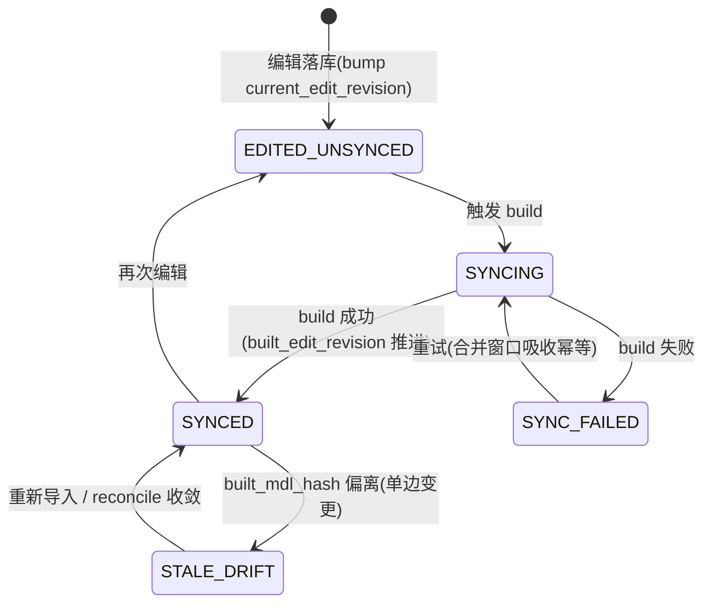
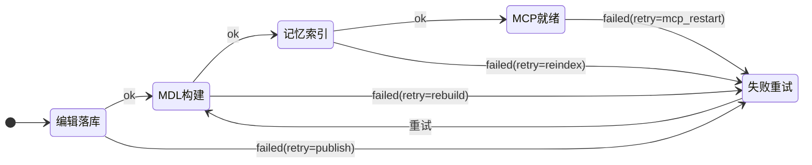
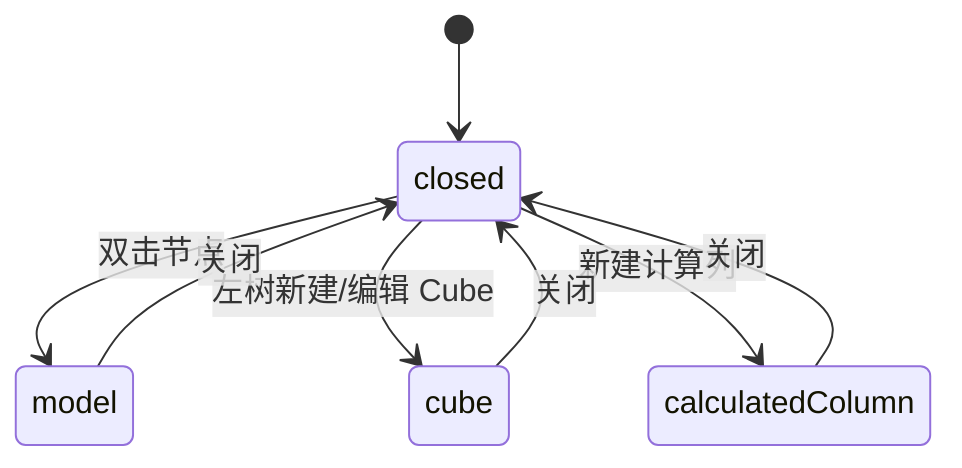

# `features/agent/iqd` — 问数域（含可视化建模台）组件索引

> MIS 平台 · WrenAI 问数 APP 前端域。路由前缀 `/iqd/*`（V77 独立门户，原 `/ai/iqd` 已迁移）。
> 本文档：组件索引 + 数据流 + 状态机。配套后端/运维见 `docs/ai-fusion/wrenai/mis-iqd-modeling-*.md`。

---

## 1. 目录结构

```
features/agent/iqd/
├─ iqd-*-page.tsx            # 8 个路由页（问数/建模台/连接/语义模型/范围/测试问数/审计/脱敏/指令）
├─ nav-registration.test.ts  # 导航四处同改的守卫测试
├─ api/                      # wire 层（snake_case，baseURL=/api/v1）
│  ├─ iqd-modeling.ts        # 连接向导/节点族/关系/Cube/计算列/依赖/MCP/布局
│  ├─ iqd-discovery.ts       # 表发现（Worker）
│  └─ iqd-layout.ts          # ⚠️ 已作废（T01 占位，无调用方；布局请用 iqd-modeling.ts）
├─ components/
│  ├─ modeling/              # ★ 建模台（画布/树/属性/关系/Cube/流水线/漂移/布局）
│  ├─ wizard/                # 连接向导 + 表发现向导
│  ├─ scope/                 # 范围与权限（行级维度徽标 rowScopeUtils）
│  ├─ enhance/               # 知识与规则 / 样本对（SqlEditor）
│  ├─ instruction/           # 指令 Tab 面板（并入 enhance）
│  └─ shared/                # IqdIcon / usePermission / useSyncStatus / relatedItemKeys
├─ hooks/                    # useCatalogNodes / useCodeMirror / useDirtyState / useModelLayout
├─ store/modeling-store.ts   # zustand：仅 UI 态（选中/视口/抽屉/脏草稿）
└─ types/modeling.ts         # 类型（wire + UI）
```

**架构约束**：
- **catalog 是模型，画布是视图**。真值单一来源于服务端 catalog（TanStack Query）；画布只产生「编辑意图」（走 `api/*` 写端点）。zustand **只存 UI 态**（选中项/视口/抽屉开合/脏标记），nodes/edges 由 catalog 派生，**不做第二份真值**。
- `lib/nav/*` 层不 import `features/*`（`arch/no-cross-feature`）；页面组件由 `keep-alive-outlet` 懒加载。

---

## 2. 组件索引（建模台 `components/modeling/`）

| 组件 | 职责 | 关键关联 |
|---|---|---|
| `ModelCanvas.tsx` | 画布（`@xyflow/react`）：节点 + 关系连线 + 缩放/小地图；拖拽连线建关系入口 | 数据源 `useCatalogNodes`；只读/编辑按 `iqd:modeling:edit` |
| `ModelNodeCard.tsx` | 模型节点卡：字段列表（默认折叠前 8 列）、PK/时间维度/计算列/脱敏徽标、cube 指标角标 | 双击进 `ModelEditDrawer` |
| `ModelTree.tsx` | 左树：连接 → 表/模型/Cube 分组 + 搜索 + 「表发现导入」/「新建 Cube」入口 | 选中/双击联动画布 |
| `RelationEdge.tsx` | 关系边：线型/箭头编码 cardinality（1:N/N:1/1:1/N:N），hover 显 condition | 点击进 `RelationshipDialog` |
| `RelationshipDialog.tsx` | 关系弹窗（join 类型 / cardinality / condition，预填两端） | `createRelationship` |
| `CubeEditor.tsx` | Cube 编辑器（measures / dimensions / 依赖提示） | `createCube` / `upsertCube`（PUT 全量替换语义） |
| `MeasureDimensionList.tsx` | measure/dimension 子节点增删改列表 | `cubeUtils` |
| `PropertyPanel.tsx` | 属性面板：选中节点字段列表 / 业务描述 / 脱敏标记 / 依赖方（MR-09/13） | `updateCatalogNode`（`PUT /catalog/node`） |
| `DriftDetailPanel.tsx` | 漂移详情（MR-11）：差异项 + 「重新导入」收敛 | `driftUtils` |
| `PublishPipelineBar.tsx` | 发布流水线（MR-10）：4 段 5 态徽标 + 强制重建/重新索引/模型校验 | 见 §4 状态机 |
| `AutoLayoutButton.tsx` | 一键 dagre 自动布局 | `useModelLayout`（`auto-layout` 端点） |

**纯函数工具**（可单测）：`relationUtils` / `cubeUtils` / `driftUtils` / `propertyEditUtils`。

## 3. Hooks / Store / API

| 单元 | 职责 |
|---|---|
| `hooks/useCatalogNodes.ts` | TanStack Query：拉 catalog，派生画布 nodes/edges（单一真值源） |
| `hooks/useModelLayout.ts` | 布局读写（`GET/PUT layout`、`auto-layout`），`base_version` 乐观并发 |
| `hooks/useDirtyState.ts` | 脏草稿 + 幂等键 `buildIdempotencyKey`（模板见 §5） |
| `hooks/useCodeMirror.ts` | CodeMirror 6 懒加载封装（ref_sql / 计算列 / 样本对 SQL） |
| `store/modeling-store.ts` | zustand：`selectedNodeIds` / `viewport` / `drawer` / `dirtyDrafts` |
| `components/shared/usePermission.ts` | 读权限 → `PermissionGate` 控制编辑可用性 |

---

## 4. 状态机

### 4.1 编辑/发布态（`IqdCatalogEditStatus`，服务端派生）

> 漂移期 **fail-closed**：整条流水线置橙、强制重建置灰。

### 4.2 发布流水线 4 段（`PublishPipelineBar`，每段 `ok|active|failed|idle|blocked`）

- 失败段红色 + 段内「重试」；`edit_status=STALE_DRIFT` 或 `stale_drift=true` → 整条橙并阻断重建（MR-11 详情入口）。

### 4.3 建模台 UI 抽屉（`store/modeling-store.ts`）

> `DrawerKind = 'closed' | 'model' | 'cube' | 'calculatedColumn'`。

---

## 5. 约定（约定俗成，改动前先看）

- **权限码**：建模台 `iqd:modeling:{view,edit,publish}`（V87）+ `iqd:mcp:manage`（V89）。前端 `PermissionGate` 必须与后端 `@PreAuthorize`/程序化校验**同码**，否则「前端放行、后端 40300」。
- **幂等键**：`{connId}:{kind}:{action}:{uuid}`（`useDirtyState.buildIdempotencyKey`）；`action ∈ {create,update}`，`kind ∈ {relationship,cube,column,model}`。后端 `iqd_edit_idempotency` 命中即返回首次结果、**不二次 bump**。
- **Cube upsert = 全量替换**：`PUT /catalog/cube` 的 `measures/dimensions` 必须带**完整集合**，缺省/空 = 清空子节点（孤儿清理）。
- **导入 ≠ 可问**：表导入 `in_scope` 默认 `false`，纳入问数须去 `/iqd/scope` 勾选。
- **命名边界**：平台域用 `iqd`；对外 WrenAI 保留 `wren`（`wren_ref_id` / `wren_sql` / `wren profile add` 等）。**不得在平台域新造 `wren*` 概念**。
- **Wire 一律 snake_case**；前端内部 camelCase 仅出现在类型/局部变量。
- **新增页面四处同改**：`lib/nav/iqd-nav.ts` + `keep-alive-outlet.tsx` 的 `PAGE_MAP` + `app/router.tsx`（通常零改，`/iqd/*` 整体登记）+ `V8y` 种子；icon 必须登记到 `lib/nav/icons.ts` 的 `ICON_MAP`，否则**静默回退** `LayoutDashboard`。

---

## 6. 测试

- 与源码同目录的 `*.test.ts(x)`（vitest）。纯函数工具、store、hooks、组件均有对应用例。
- `nav-registration.test.ts` 守卫「四处同改」。
- 门禁：`npm run typecheck && npm run test`（基线 34 files / 429 passed）。
